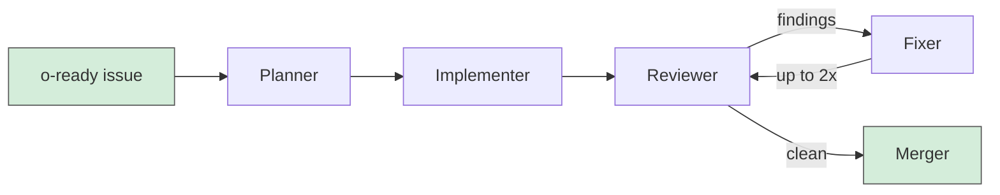

# oven 🍞

let 'em cook.

Oven is a CLI that runs Claude Code agent pipelines against your GitHub issues. Label an issue, walk away, come back to a PR with code, tests, and a review.

## How it works

1. You label a GitHub issue `o-ready`
2. Oven picks it up, plans a dependency graph, and creates draft PRs
3. An implementer writes the code and tests
4. A reviewer checks quality, security, and simplicity
5. A fixer addresses any findings (up to 2 rounds, can dispute false positives)
6. You get a PR ready for human review

All agent activity shows up as comments on the PR. You stay in the loop without being in the way.



The planner builds a dependency graph across issues so dependent work waits for its prerequisites to merge before starting.

Oven keeps polling while it works. Issues with no dependencies run in parallel, and new issues get picked up automatically mid-run.

## Install

You'll need [`gh`](https://cli.github.com/) and [`claude`](https://docs.anthropic.com/en/docs/claude-code) installed and authenticated.

```
cargo install oven-cli
```

## Quick start

```bash
# Set up your project
oven prep

# Start cooking (foreground)
oven on

# Or run specific issues
oven on 123,245

# Skip author validation for explicit IDs
oven on 123 --trust

# Detached mode
oven on -d

# Auto-merge when done
oven on -m
```

## Commands

```
oven prep              Set up project (recipe.toml, agents, db)
oven on [IDS]          Start the pipeline (-d detached, -m auto-merge, --trust)
oven off               Stop a detached run
oven look [RUN_ID]     View logs (--agent <name> to filter)
oven report [RUN_ID]   Costs, runtime, summary (--all, --json, --graph)
oven clean             Remove worktrees, logs, merged branches
oven ticket            Local issue management (create, list, view, close, label, edit)
```

## Config

Project config lives in `recipe.toml` at your repo root. User defaults go in `~/.config/oven/recipe.toml`.

```toml
[project]
test = "cargo test"
lint = "cargo clippy"
# issue_source = "local"  # use local tickets instead of GitHub issues

[pipeline]
max_parallel = 2
cost_budget = 15.0
poll_interval = 60
```

Multi-repo support goes in the user config:

```toml
[repos]
api = "/home/you/dev/api"
frontend = "/home/you/dev/frontend"
```

Issues in your main repo can target other repos via `target_repo` frontmatter. Oven handles the worktree routing.

## Labels

| Label | Meaning |
|-------|---------|
| `o-ready` | Ready for pickup |
| `o-cooking` | In progress |
| `o-complete` | Done |
| `o-failed` | Something went wrong |

## GitHub Action

Oven ships a GitHub Action so you can run pipelines in CI. Triggers on issue labeling, uses GitHub App auth, and sets up per-issue concurrency groups. See [`action/README.md`](action/README.md) for setup.

## Local issues

Don't want to use GitHub issues? Set `issue_source = "local"` in your `recipe.toml` and use tickets:

```bash
oven ticket create "Add retry logic" --ready
oven ticket create "Fix auth" --ready --repo backend
oven ticket list --status open
oven ticket label 1 o-cooking
oven ticket edit 1
oven ticket close 1
```

Tickets are markdown files in `.oven/issues/`. Oven picks them up the same way it picks up GitHub issues. PRs still go to GitHub.

## Skills

`oven prep` scaffolds Claude Code skills into `.claude/skills/` for use alongside your normal development workflow.

**`/cook`** -- Interactive issue design. Researches your codebase, asks targeted clarifying questions, and produces an implementation-ready issue that an agent with zero prior context can pick up. Creates the issue via `gh issue create` or `oven ticket create` depending on your `issue_source` config.

**`/refine`** -- Codebase audit across six dimensions: security, error handling, patterns, test gaps, data issues, and dependencies. Runs static analysis tools, performs manual code review, and produces a prioritized findings report. Offers to generate issues from critical and high findings.

---

Built with Rust. 🍞
