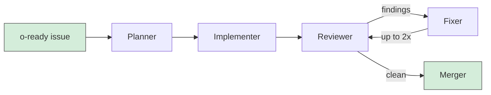

# oven

let 'em cook.

Oven is a CLI that runs Claude Code agent pipelines against your GitHub issues. Label an issue, walk away, come back to a PR with code, tests, and a review.

## How it works

1. You label a GitHub issue `o-ready`
2. Oven picks it up, creates a draft PR, and gets to work
3. An implementer writes the code and tests
4. A reviewer checks quality, security, and simplicity
5. A fixer addresses any findings (up to 2 rounds)
6. You get a PR ready for human review

All agent activity shows up as comments on the PR. You stay in the loop without being in the way.



Oven keeps polling while it works. New issues that can run in parallel get picked up automatically, even mid-run.

## Install

You'll need [`gh`](https://cli.github.com/) and [`claude`](https://docs.anthropic.com/en/docs/claude-code) installed and authenticated.

```
cargo install oven-cli
```

## Quick start

```bash
# Set up your project
oven prep

# Start cooking (foreground)
oven on

# Or run specific issues
oven on 123,245

# Detached mode
oven on -d

# Auto-merge when done
oven on -m
```

## Commands

```
oven prep              Set up project (recipe.toml, agents, db)
oven on [IDS]          Start the pipeline (-d detached, -m auto-merge)
oven off               Stop a detached run
oven look [RUN_ID]     View logs (--agent <name> to filter)
oven report [RUN_ID]   Costs, runtime, summary (--all, --json)
oven clean             Remove worktrees, logs, merged branches
oven ticket            Local issue management (create, list, view, close)
```

## Config

Project config lives in `recipe.toml` at your repo root. User defaults go in `~/.config/oven/recipe.toml`.

```toml
[project]
test = "cargo test"
lint = "cargo clippy"

[pipeline]
max_parallel = 2
cost_budget = 15.0
poll_interval = 60
```

Multi-repo support goes in the user config:

```toml
[repos]
api = "/home/you/dev/api"
frontend = "/home/you/dev/frontend"
```

Issues in your main repo can target other repos. Oven handles the worktree routing.

## Labels

| Label | Meaning |
|-------|---------|
| `o-ready` | Ready for pickup |
| `o-cooking` | In progress |
| `o-complete` | Done |
| `o-failed` | Something went wrong |

## GitHub Actions

Oven ships a GitHub Action so you can run pipelines in CI. Uses GitHub App auth, pinned dependencies, and per-issue concurrency. See the action docs for setup.

## Local issues

Don't want to use GitHub issues? Use tickets:

```bash
oven ticket create "Add retry logic" --ready
oven ticket list
oven ticket view 1
oven ticket close 1
```

Tickets are markdown files in `.oven/issues/`. Oven picks them up the same way.

---

Built with Rust.
