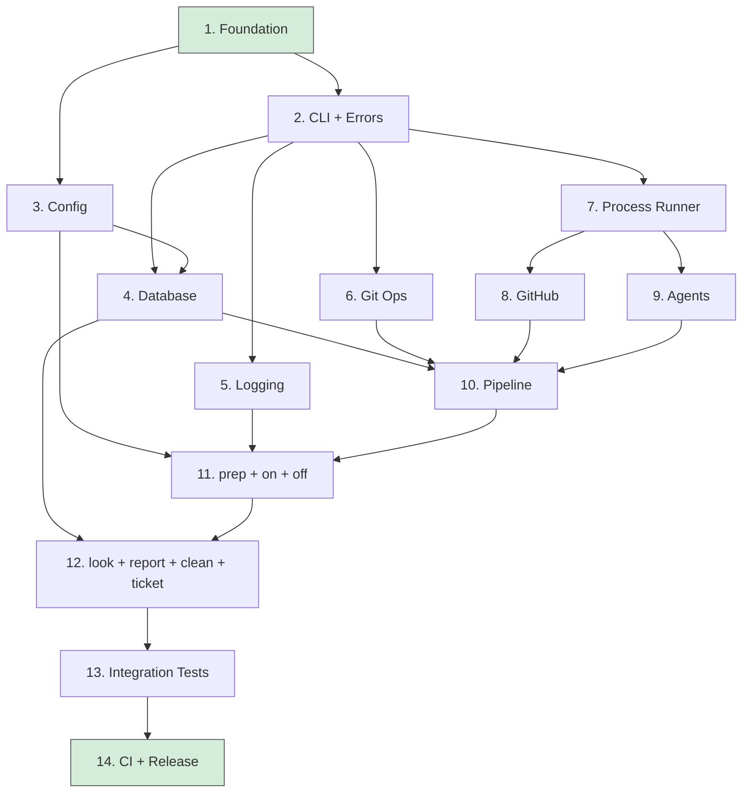

# Roadmap

Phased implementation plan for oven-cli. Each phase is a self-contained unit of work that can be implemented end-to-end in one session using atomic conventional commits. Every phase must compile, pass clippy, pass fmt, and have tests green before moving to the next.

Read CLAUDE.md for conventions, dependencies, and project structure. Read DECISIONS.md for design rationale.

## Phase dependency graph



Phases on the same level can be worked in parallel if desired (e.g., 6, 7 can happen simultaneously). Most phases depend on 1 and 2 being done first.

## Progress

| Phase | Status | Notes |
|-------|--------|-------|
| 1. Foundation | done | Cargo.toml, rustfmt, deny, nextest, gitignore |
| 2. CLI + Errors | done | All subcommands, thiserror types, clap debug_assert test |
| 3. Config | done | Two-level TOML loading, 8 tests |
| 4. Database | done | SQLite WAL, migrations, CRUD for runs/agent_runs/findings, 20 tests |
| 5. Logging | done | Dual-output tracing (stderr + JSON file) |
| 6. Git Ops | done | Worktree create/remove/list/clean, branch ops, 5 async tests |
| 7. Process Runner | done | CommandRunner trait, stream-json parser, 8 tests |
| 8. GitHub | done | GhClient for labels/issues/PRs, 11 mock tests |
| 9. Agents | done | 5 roles with askama templates, review parser, 15 tests |
| 10. Pipeline | done | State machine, executor with review-fix loop, parallel runner, polling loop, 15 tests |
| 11. prep + on + off | done | Scaffolding with embedded templates, pipeline startup, detached mode, PID-based stop, 13 tests |
| 12. look + report + clean + ticket | done | Log tailing, cost reports with JSON, selective cleanup, ticket CRUD, 20 tests |
| 13. Integration Tests | not started | |
| 14. CI + Release | not started | |

---

## Phase 1: Foundation

**Goal:** Cargo project skeleton with all config files, lints, formatting, and an empty binary that compiles clean.

**Files to create:**
- `Cargo.toml`
- `src/main.rs`
- `src/lib.rs`
- `rustfmt.toml`
- `deny.toml`
- `.config/nextest.toml`
- `.gitignore`

### Details

**Cargo.toml** - edition 2024, rust-version 1.85, all dependencies and dev-dependencies from CLAUDE.md. Include `[lints]` section with clippy and rust lint config. Include release profile with `lto = "thin"`, `codegen-units = 1`, `strip = "symbols"`, `panic = "abort"`.

**src/main.rs** - just `fn main() { println!("oven"); }` for now. Annotate with `#[cfg_attr(coverage_nightly, feature(coverage_attribute))]` at crate level for future coverage exclusion.

**src/lib.rs** - empty, just a comment placeholder.

**rustfmt.toml** - as specified in CLAUDE.md.

**deny.toml:**
```toml
[advisories]
vulnerability = "deny"
unmaintained = "warn"
unsound = "deny"

[licenses]
unlicensed = "deny"
default = "deny"
allow = [
    "MIT",
    "Apache-2.0",
    "BSD-2-Clause",
    "BSD-3-Clause",
    "ISC",
    "Zlib",
    "MPL-2.0",
    "Unicode-3.0",
    "Unicode-DFS-2016",
]

[bans]
multiple-versions = "warn"

[sources]
unknown-registry = "deny"
unknown-git = "deny"
```

**.config/nextest.toml:**
```toml
[profile.default]
fail-fast = true

[profile.ci]
fail-fast = false
retries = 2
slow-timeout = { period = "60s", terminate-after = 3 }
```

**.gitignore** - standard Rust gitignore plus `.oven/` directory.

### Commits
1. `chore: initialize cargo project with edition 2024`
2. `chore: add rustfmt, clippy, deny, and nextest config`

### Done when
- `cargo build` succeeds
- `cargo clippy --all-targets -- -D warnings` passes
- `cargo +nightly fmt --check` passes (install nightly if needed)
- `cargo deny check` passes (run `cargo install cargo-deny` first)
- Binary runs and prints "oven"

---

## Phase 2: CLI Skeleton + Error Types

**Goal:** Full clap CLI with all subcommands defined (stub implementations that print "not implemented"). Typed error enums for each module boundary.

**Depends on:** Phase 1

**Files to create:**
- `src/cli/mod.rs`
- `src/cli/prep.rs`
- `src/cli/on.rs`
- `src/cli/off.rs`
- `src/cli/look.rs`
- `src/cli/report.rs`
- `src/cli/clean.rs`
- `src/cli/ticket.rs`
- `src/errors.rs`

**Files to modify:**
- `src/main.rs`
- `src/lib.rs`

### Details

**CLI structure** (clap derive):

```rust
#[derive(Parser)]
#[command(name = "oven", about = "let 'em cook", version)]
pub struct Cli {
    #[command(flatten)]
    pub global: GlobalOpts,
    #[command(subcommand)]
    pub command: Commands,
}

#[derive(Args)]
pub struct GlobalOpts {
    #[arg(global = true, short, long)]
    pub verbose: bool,
    #[arg(global = true, short, long)]
    pub quiet: bool,
}

#[derive(Subcommand)]
pub enum Commands {
    Prep(PrepArgs),
    On(OnArgs),
    Off,
    Look(LookArgs),
    Report(ReportArgs),
    Clean(CleanArgs),
    Ticket(TicketArgs),
}
```

Define argument structs for each command matching the CLI API in DECISIONS.md. Key args:
- `OnArgs`: `ids: Option<String>`, `-d`/`--detached`, `-m`/`--merge`
- `LookArgs`: `run_id: Option<String>`, `--agent <NAME>`
- `ReportArgs`: `run_id: Option<String>`, `--all`, `--json`
- `CleanArgs`: `--only-logs`, `--only-trees`, `--only-branches`
- `TicketArgs`: subcommand enum with Create, List, View, Close
- `PrepArgs`: `--force`

**Error types** (thiserror):

```rust
#[derive(thiserror::Error, Debug)]
pub enum OvenError {
    #[error("config error: {0}")]
    Config(String),
    #[error("database error: {0}")]
    Database(#[from] rusqlite::Error),
    #[error("git error: {0}")]
    Git(String),
    #[error("pipeline error: {0}")]
    Pipeline(String),
    #[error("agent {agent} failed: {message}")]
    Agent { agent: String, message: String },
    #[error("github error: {0}")]
    GitHub(String),
    #[error("process error: {0}")]
    Process(String),
    #[error("{0}")]
    Other(#[from] anyhow::Error),
}
```

**main.rs** wiring: parse CLI, match on command, call stub functions that return `anyhow::Result<()>`. Use `#[tokio::main]` async main.

Each command handler file exports an `async fn run(args: XxxArgs, global: &GlobalOpts) -> anyhow::Result<()>` that prints "not implemented" and returns Ok.

Add a `Cli::command().debug_assert()` test in cli/mod.rs to validate clap config at test time.

### Commits
1. `feat(errors): add thiserror error types`
2. `feat(cli): add clap definitions for all commands and subcommands`
3. `feat(cli): wire stub command handlers to main`

### Done when
- `cargo build` succeeds
- `oven --help` prints help with all subcommands listed
- `oven prep --help`, `oven on --help`, etc. all work
- `oven on` prints "not implemented" and exits 0
- `oven ticket create "test"` prints "not implemented"
- `Cli::command().debug_assert()` test passes
- Clippy and fmt clean

---

## Phase 3: Configuration System

**Goal:** Two-level TOML config loading with user defaults merged under project overrides. Type-safe config struct with serde deserialization and sensible defaults.

**Depends on:** Phase 1

**Files to create:**
- `src/config/mod.rs`

**Files to modify:**
- `src/lib.rs`

### Details

**Config struct:**
```rust
#[derive(Debug, Clone, Serialize, Deserialize)]
#[serde(default)]
pub struct Config {
    pub project: ProjectConfig,
    pub pipeline: PipelineConfig,
    pub labels: LabelConfig,
    #[serde(default)]
    pub repos: HashMap<String, PathBuf>,
}

#[derive(Debug, Clone, Serialize, Deserialize)]
#[serde(default)]
pub struct ProjectConfig {
    pub name: Option<String>,
    pub test: Option<String>,
    pub lint: Option<String>,
}

#[derive(Debug, Clone, Serialize, Deserialize)]
#[serde(default)]
pub struct PipelineConfig {
    pub max_parallel: u32,
    pub cost_budget: f64,
    pub poll_interval: u64,
    pub turn_limit: u32,
}

#[derive(Debug, Clone, Serialize, Deserialize)]
#[serde(default)]
pub struct LabelConfig {
    pub ready: String,
    pub cooking: String,
    pub complete: String,
    pub failed: String,
}
```

**Default values:**
- `max_parallel`: 2
- `cost_budget`: 15.0
- `poll_interval`: 60
- `turn_limit`: 50
- Labels: `o-ready`, `o-cooking`, `o-complete`, `o-failed`

**Loading logic:**
1. Load user config from `~/.config/oven/recipe.toml` (use `dirs::config_dir()`). Missing file is not an error - use defaults.
2. Load project config from `recipe.toml` in the working directory. Missing file is not an error for most commands (only `oven on` requires it).
3. Merge: start with defaults, apply user config, apply project config on top. For `repos`, only take from user config (never project config - security).
4. `Config::load(project_dir: &Path) -> anyhow::Result<Config>`
5. `Config::default_project_toml() -> String` for `oven prep` to write a starter file.

**Merging strategy:** deserialize both files into `Config` using serde defaults, then selectively override. The project config's non-None/non-default values win over user config. Use a manual merge function rather than a library to keep it simple and explicit.

**Tests:**
- Loading from a valid TOML string
- Missing file returns defaults
- Project overrides user values
- `repos` key ignored in project config
- Default values are correct
- Invalid TOML returns descriptive error
- Proptest: config roundtrips through serialize/deserialize

### Commits
1. `feat(config): add config types with serde and defaults`
2. `feat(config): add layered config loading from user and project files`
3. `test(config): add config loading, merging, and roundtrip tests`

### Done when
- Config loads from TOML strings and files
- Layered merge works correctly (user < project)
- All tests pass including proptest roundtrip
- Clippy and fmt clean

---

## Phase 4: Database Layer

**Goal:** SQLite database with WAL mode, migration system, and CRUD operations for pipeline runs and agent runs.

**Depends on:** Phase 2, Phase 3

**Files to create:**
- `src/db/mod.rs`
- `src/db/runs.rs`
- `src/db/agent_runs.rs`

**Files to modify:**
- `src/lib.rs`

### Details

**Connection setup:**
```rust
pub fn open(path: &Path) -> anyhow::Result<Connection> {
    let conn = Connection::open(path)
        .context("opening database")?;
    conn.pragma_update(None, "journal_mode", "WAL")?;
    conn.pragma_update(None, "synchronous", "NORMAL")?;
    conn.pragma_update(None, "busy_timeout", "5000")?;
    conn.pragma_update(None, "foreign_keys", "ON")?;
    MIGRATIONS.to_latest(&mut conn)
        .context("running database migrations")?;
    Ok(conn)
}
```

**Schema (migration 1):**
```sql
CREATE TABLE runs (
    id TEXT PRIMARY KEY,
    issue_number INTEGER NOT NULL,
    status TEXT NOT NULL DEFAULT 'pending',
    pr_number INTEGER,
    branch TEXT,
    worktree_path TEXT,
    cost_usd REAL NOT NULL DEFAULT 0.0,
    auto_merge INTEGER NOT NULL DEFAULT 0,
    started_at TEXT NOT NULL DEFAULT (datetime('now')),
    finished_at TEXT,
    error_message TEXT
);

CREATE TABLE agent_runs (
    id INTEGER PRIMARY KEY AUTOINCREMENT,
    run_id TEXT NOT NULL REFERENCES runs(id) ON DELETE CASCADE,
    agent TEXT NOT NULL,
    cycle INTEGER NOT NULL DEFAULT 1,
    status TEXT NOT NULL DEFAULT 'pending',
    cost_usd REAL NOT NULL DEFAULT 0.0,
    turns INTEGER NOT NULL DEFAULT 0,
    started_at TEXT NOT NULL DEFAULT (datetime('now')),
    finished_at TEXT,
    output_summary TEXT,
    error_message TEXT
);

CREATE TABLE review_findings (
    id INTEGER PRIMARY KEY AUTOINCREMENT,
    agent_run_id INTEGER NOT NULL REFERENCES agent_runs(id) ON DELETE CASCADE,
    severity TEXT NOT NULL CHECK (severity IN ('critical', 'warning', 'info')),
    category TEXT NOT NULL,
    file_path TEXT,
    line_number INTEGER,
    message TEXT NOT NULL,
    resolved INTEGER NOT NULL DEFAULT 0
);

CREATE INDEX idx_runs_status ON runs(status);
CREATE INDEX idx_runs_issue ON runs(issue_number);
CREATE INDEX idx_agent_runs_run ON agent_runs(run_id);
CREATE INDEX idx_findings_agent_run ON review_findings(agent_run_id);
CREATE INDEX idx_findings_severity ON review_findings(severity);
```

**Rust types** mirroring the schema:
```rust
pub struct Run {
    pub id: String,
    pub issue_number: u32,
    pub status: RunStatus,
    pub pr_number: Option<u32>,
    pub branch: Option<String>,
    pub worktree_path: Option<String>,
    pub cost_usd: f64,
    pub auto_merge: bool,
    pub started_at: String,
    pub finished_at: Option<String>,
    pub error_message: Option<String>,
}

#[derive(Debug, Clone, PartialEq)]
pub enum RunStatus {
    Pending,
    Implementing,
    Reviewing,
    Fixing,
    Merging,
    Complete,
    Failed,
}
```

Implement `Display` and `FromStr` for `RunStatus` to map to/from the TEXT column.

**CRUD in runs.rs:**
- `insert_run(conn, run) -> Result<()>`
- `get_run(conn, id) -> Result<Option<Run>>`
- `get_runs_by_status(conn, status) -> Result<Vec<Run>>`
- `get_latest_run(conn) -> Result<Option<Run>>`
- `get_all_runs(conn) -> Result<Vec<Run>>`
- `update_run_status(conn, id, status) -> Result<()>`
- `update_run_pr(conn, id, pr_number) -> Result<()>`
- `update_run_cost(conn, id, cost_usd) -> Result<()>`
- `finish_run(conn, id, status, error_message) -> Result<()>`

**CRUD in agent_runs.rs:**
- `insert_agent_run(conn, agent_run) -> Result<i64>` (returns inserted id)
- `get_agent_runs_for_run(conn, run_id) -> Result<Vec<AgentRun>>`
- `finish_agent_run(conn, id, status, cost, turns, output_summary, error) -> Result<()>`
- `insert_finding(conn, finding) -> Result<()>`
- `get_findings_for_agent_run(conn, agent_run_id) -> Result<Vec<ReviewFinding>>`
- `get_unresolved_findings(conn, run_id) -> Result<Vec<ReviewFinding>>`
- `resolve_finding(conn, finding_id) -> Result<()>`

All queries use `params![]` macro. Never string interpolation.

**Tests** (all use `Connection::open_in_memory()`):
- `MIGRATIONS.validate()` passes
- Insert and retrieve a run
- Update run status and verify
- Insert agent runs and findings
- Query by status filters correctly
- Cascade delete works (delete run removes agent_runs and findings)
- RunStatus roundtrips through Display/FromStr

### Commits
1. `feat(db): add SQLite connection setup with WAL and migrations`
2. `feat(db): add run CRUD operations`
3. `feat(db): add agent run and review finding CRUD`
4. `test(db): add database tests with in-memory SQLite`

### Done when
- Database opens, creates tables, runs migrations
- All CRUD operations work
- All tests pass (10+ test cases)
- Migrations validate
- Clippy and fmt clean

---

## Phase 5: Logging and Tracing

**Goal:** Dual-output tracing setup. Human-readable output to stderr (foreground mode), structured JSON to per-run log files.

**Depends on:** Phase 2

**Files to create:**
- `src/logging.rs`

**Files to modify:**
- `src/lib.rs`

### Details

```rust
use tracing_subscriber::{fmt, EnvFilter, layer::SubscriberExt, util::SubscriberInitExt};
use tracing_appender::non_blocking::WorkerGuard;

pub fn init_stderr_only() {
    tracing_subscriber::registry()
        .with(EnvFilter::try_from_default_env()
            .unwrap_or_else(|_| EnvFilter::new("oven=info")))
        .with(fmt::layer().with_writer(std::io::stderr))
        .init();
}

pub fn init_with_file(log_dir: &Path, verbose: bool) -> WorkerGuard {
    let file_appender = tracing_appender::rolling::never(log_dir, "pipeline.log");
    let (non_blocking, guard) = tracing_appender::non_blocking(file_appender);

    let env_filter = if verbose {
        EnvFilter::new("oven=debug")
    } else {
        EnvFilter::try_from_default_env()
            .unwrap_or_else(|_| EnvFilter::new("oven=info"))
    };

    tracing_subscriber::registry()
        .with(env_filter)
        .with(fmt::layer().with_writer(std::io::stderr))
        .with(fmt::layer().json().with_writer(non_blocking))
        .init();

    guard // caller MUST hold this until shutdown
}
```

Key points:
- `init_stderr_only()` for commands that don't need file logging (prep, look, report, clean, ticket).
- `init_with_file()` for `oven on` - returns a `WorkerGuard` that must be held in main until exit. Dropping it flushes and stops the background writer thread.
- The `verbose` flag maps to debug-level logging.
- `RUST_LOG` env var overrides the default filter via `EnvFilter::try_from_default_env()`.
- Use `#[instrument]` on key functions for automatic span creation with function arguments.

**Tests:**
- `init_stderr_only()` doesn't panic
- Verify the guard pattern works (no test for file contents - that's an integration concern)

### Commits
1. `feat(logging): add dual-output tracing setup with file and stderr`

### Done when
- Logging initializes without panic
- stderr output works in foreground
- File logging writes to the specified directory
- RUST_LOG override works
- Clippy and fmt clean

---

## Phase 6: Git Operations

**Goal:** Worktree management - create, remove, list, and clean worktrees. Branch naming. All operations shell out to `git` CLI via tokio.

**Depends on:** Phase 2

**Files to create:**
- `src/git/mod.rs`

**Files to modify:**
- `src/lib.rs`

### Details

**Worktree struct:**
```rust
pub struct Worktree {
    pub path: PathBuf,
    pub branch: String,
    pub issue_number: u32,
}
```

**Branch naming:** `oven/issue-{issue_number}-{short_hex}` where short_hex is 8 chars from uuid.

**Functions:**
- `create_worktree(repo_dir, issue_number, base_branch) -> Result<Worktree>` - runs `git worktree add -b <branch> <path> <base>`. Path is `.oven/worktrees/issue-{number}/`.
- `remove_worktree(repo_dir, worktree_path) -> Result<()>` - runs `git worktree remove --force <path>`.
- `list_worktrees(repo_dir) -> Result<Vec<WorktreeInfo>>` - runs `git worktree list --porcelain`, parses output.
- `clean_worktrees(repo_dir) -> Result<u32>` - prune stale worktrees, return count removed.
- `delete_branch(repo_dir, branch) -> Result<()>` - `git branch -D <branch>`.
- `list_merged_branches(repo_dir, base) -> Result<Vec<String>>` - `git branch --merged <base>`, filter to `oven/*` branches.
- `push_branch(repo_dir, branch) -> Result<()>` - `git push origin <branch>`.

All git commands run via `tokio::process::Command` with `kill_on_drop(true)`. Capture stdout and stderr. Return descriptive errors on non-zero exit with stderr content.

Helper function:
```rust
async fn run_git(repo_dir: &Path, args: &[&str]) -> Result<String> {
    let output = Command::new("git")
        .args(args)
        .current_dir(repo_dir)
        .kill_on_drop(true)
        .output()
        .await
        .context("spawning git")?;
    if !output.status.success() {
        let stderr = String::from_utf8_lossy(&output.stderr);
        anyhow::bail!("git {} failed: {}", args.join(" "), stderr.trim());
    }
    Ok(String::from_utf8_lossy(&output.stdout).trim().to_string())
}
```

**Tests:**
- Create a worktree in a temp git repo (init a real repo with `git init` in tempdir)
- Verify worktree exists on filesystem after creation
- Remove worktree and verify cleanup
- List worktrees returns correct info
- Branch naming follows convention
- Error on non-git directory

### Commits
1. `feat(git): add git command runner helper`
2. `feat(git): add worktree create, remove, list, and clean`
3. `test(git): add worktree management tests with real git repos`

### Done when
- Can create and remove worktrees in a temp git repo
- Branch naming is correct
- Error messages are descriptive
- All tests pass
- Clippy and fmt clean

---

## Phase 7: Process Runner and Stream Parser

**Goal:** Subprocess spawning with streaming stdout, and a parser for Claude's `stream-json` output format. Cost and duration extraction.

**Depends on:** Phase 2

**Files to create:**
- `src/process/mod.rs`
- `src/process/stream.rs`

**Files to modify:**
- `src/lib.rs`

### Details

**CommandRunner trait** (for mocking in tests):
```rust
#[cfg_attr(test, mockall::automock)]
#[async_trait::async_trait]
pub trait CommandRunner: Send + Sync {
    async fn run_claude(
        &self,
        prompt: &str,
        allowed_tools: &[&str],
        working_dir: &Path,
    ) -> Result<AgentResult>;

    async fn run_gh(
        &self,
        args: &[&str],
        working_dir: &Path,
    ) -> Result<CommandOutput>;
}
```

Wait - avoid async_trait if possible. With Rust edition 2024 and recent stable, native async traits work. Use `trait CommandRunner: Send + Sync` with `async fn` directly.

**Real implementation:**
```rust
pub struct RealCommandRunner;

impl CommandRunner for RealCommandRunner {
    async fn run_claude(...) -> Result<AgentResult> {
        let mut child = Command::new("claude")
            .args(["-p", "--output-format", "stream-json"])
            .args(["--allowedTools", &allowed_tools.join(",")])
            .arg("--")
            .arg(prompt)
            .current_dir(working_dir)
            .stdout(Stdio::piped())
            .stderr(Stdio::piped())
            .kill_on_drop(true)
            .spawn()?;

        let stdout = child.stdout.take().unwrap();
        let result = parse_stream(stdout).await?;
        let status = child.wait().await?;
        // ...
    }
}
```

**Stream-json events** (from claude CLI output, one JSON object per line):

The key events to parse:
```rust
#[derive(Debug, Deserialize)]
#[serde(tag = "type")]
pub enum StreamEvent {
    #[serde(rename = "system")]
    System { subtype: String },
    #[serde(rename = "assistant")]
    Assistant { message: AssistantMessage },
    #[serde(rename = "result")]
    Result { result: ResultData },
}

#[derive(Debug, Deserialize)]
pub struct ResultData {
    pub cost_usd: Option<f64>,
    pub duration_ms: Option<u64>,
    pub num_turns: Option<u32>,
    pub session_id: String,
}
```

**AgentResult:**
```rust
pub struct AgentResult {
    pub cost_usd: f64,
    pub duration: Duration,
    pub turns: u32,
    pub output: String,
    pub session_id: String,
    pub success: bool,
}
```

**parse_stream function:**
- Takes a `tokio::io::AsyncRead` (the child's stdout)
- Reads line by line with `BufReader::lines()`
- Deserializes each line as a `StreamEvent`
- Accumulates the assistant's text output
- Extracts cost/duration/turns from the `result` event
- Skips unknown event types (forward compatibility)
- Returns `AgentResult`

**CommandOutput** for gh:
```rust
pub struct CommandOutput {
    pub stdout: String,
    pub stderr: String,
    pub success: bool,
}
```

**Tests:**
- Parse a sample stream-json output (fixture string with multiple events)
- Handle missing cost fields gracefully
- Handle malformed JSON lines (skip, don't crash)
- Extract correct cost and duration from result event
- MockCommandRunner works for downstream test usage
- Property test: any valid JSON line doesn't panic the parser

### Commits
1. `feat(process): add CommandRunner trait and real implementation`
2. `feat(process): add stream-json parser with cost extraction`
3. `test(process): add stream parser and command runner tests`

### Done when
- Can spawn a subprocess and capture output
- Stream parser correctly extracts events from fixture data
- Malformed input handled gracefully (skip bad lines)
- MockCommandRunner compiles and can be used in tests
- All tests pass
- Clippy and fmt clean

---

## Phase 8: GitHub Integration

**Goal:** Wrapper around `gh` CLI for all GitHub operations - labels, issues, and pull requests.

**Depends on:** Phase 7

**Files to create:**
- `src/github/mod.rs`
- `src/github/labels.rs`
- `src/github/issues.rs`
- `src/github/prs.rs`

**Files to modify:**
- `src/lib.rs`

### Details

**GitHubClient trait** (for mocking):
```rust
#[cfg_attr(test, mockall::automock)]
pub trait GitHubClient: Send + Sync {
    async fn get_issues_by_label(&self, label: &str) -> Result<Vec<Issue>>;
    async fn add_label(&self, issue_number: u32, label: &str) -> Result<()>;
    async fn remove_label(&self, issue_number: u32, label: &str) -> Result<()>;
    async fn comment_on_issue(&self, issue_number: u32, body: &str) -> Result<()>;
    async fn create_draft_pr(&self, title: &str, branch: &str, body: &str) -> Result<u32>;
    async fn comment_on_pr(&self, pr_number: u32, body: &str) -> Result<()>;
    async fn mark_pr_ready(&self, pr_number: u32) -> Result<()>;
    async fn merge_pr(&self, pr_number: u32) -> Result<()>;
    async fn get_issue(&self, issue_number: u32) -> Result<Issue>;
    async fn ensure_labels_exist(&self, labels: &[(&str, &str)]) -> Result<()>;
}
```

**Issue struct:**
```rust
pub struct Issue {
    pub number: u32,
    pub title: String,
    pub body: String,
    pub labels: Vec<String>,
}
```

**Real implementation** uses `CommandRunner::run_gh()` from Phase 7 for all calls. Example:
```rust
// Fetch issues by label
// gh issue list --label o-ready --json number,title,body,labels --state open
async fn get_issues_by_label(&self, label: &str) -> Result<Vec<Issue>> {
    let output = self.runner.run_gh(
        &["issue", "list", "--label", label,
          "--json", "number,title,body,labels",
          "--state", "open"],
        &self.repo_dir,
    ).await?;
    let issues: Vec<Issue> = serde_json::from_str(&output.stdout)?;
    Ok(issues)
}
```

**Label transition helper** (not on the trait, local helper):
```rust
pub async fn transition_issue(
    client: &dyn GitHubClient,
    issue_number: u32,
    from: &str,
    to: &str,
) -> Result<()> {
    client.remove_label(issue_number, from).await?;
    client.add_label(issue_number, to).await?;
    Ok(())
}
```

**Label colors** for `ensure_labels_exist`:
- `o-ready`: `#0E8A16` (green)
- `o-cooking`: `#FBCA04` (yellow)
- `o-complete`: `#1D76DB` (blue)
- `o-failed`: `#D93F0B` (red)

**Error handling:**
- Comment posting should never crash the pipeline. Wrap in a helper that logs errors but returns Ok.
- Label operations can fail if the label doesn't exist yet - use `ensure_labels_exist` first.

**Tests** (all using MockGitHubClient):
- Fetch issues by label returns parsed results
- Label transition removes old and adds new
- Create draft PR returns PR number
- Comment on PR/issue works
- Error in comment is logged but doesn't propagate (test the wrapper)
- Serde deserialization of gh JSON output

### Commits
1. `feat(github): add GitHubClient trait and Issue types`
2. `feat(github): implement label operations`
3. `feat(github): implement issue and PR operations`
4. `test(github): add GitHub client tests with mocks`

### Done when
- All GitHub operations defined and implemented
- Mock works for downstream use
- JSON parsing of gh output handles all fields
- Label transitions work correctly
- All tests pass
- Clippy and fmt clean

---

## Phase 9: Agent System

**Goal:** Agent role definitions, tool scoping, prompt construction, and invocation logic. Each agent knows its tools, its prompt template, and how to invoke itself via the process runner.

**Depends on:** Phase 7

**Files to create:**
- `src/agents/mod.rs`
- `src/agents/planner.rs`
- `src/agents/implementer.rs`
- `src/agents/reviewer.rs`
- `src/agents/fixer.rs`
- `src/agents/merger.rs`

**Files to modify:**
- `src/lib.rs`

### Details

**AgentRole enum:**
```rust
#[derive(Debug, Clone, Copy, PartialEq, Eq, Hash)]
pub enum AgentRole {
    Planner,
    Implementer,
    Reviewer,
    Fixer,
    Merger,
}

impl AgentRole {
    pub fn allowed_tools(&self) -> &[&str] {
        match self {
            Self::Planner => &["Read", "Glob", "Grep"],
            Self::Implementer => &["Read", "Write", "Edit", "Glob", "Grep", "Bash"],
            Self::Reviewer => &["Read", "Glob", "Grep"],
            Self::Fixer => &["Read", "Write", "Edit", "Glob", "Grep", "Bash"],
            Self::Merger => &["Bash"],
        }
    }

    pub fn as_str(&self) -> &str {
        match self {
            Self::Planner => "planner",
            Self::Implementer => "implementer",
            Self::Reviewer => "reviewer",
            Self::Fixer => "fixer",
            Self::Merger => "merger",
        }
    }
}
```

**Agent invocation:**
```rust
pub struct AgentInvocation {
    pub role: AgentRole,
    pub prompt: String,
    pub working_dir: PathBuf,
}

pub async fn invoke_agent(
    runner: &dyn CommandRunner,
    invocation: &AgentInvocation,
) -> Result<AgentResult> {
    runner.run_claude(
        &invocation.prompt,
        invocation.role.allowed_tools(),
        &invocation.working_dir,
    ).await
}
```

**Prompt construction per agent:**

Each agent file exports a `build_prompt(context: &AgentContext) -> String` function that constructs the system prompt. The context includes issue details, PR info, review findings (for fixer), etc.

```rust
pub struct AgentContext {
    pub issue_number: u32,
    pub issue_title: String,
    pub issue_body: String,
    pub branch: String,
    pub pr_number: Option<u32>,
    pub test_command: Option<String>,
    pub lint_command: Option<String>,
    pub review_findings: Option<Vec<ReviewFinding>>,
    pub cycle: u32,
}
```

**Prompt patterns per agent:**

- **Planner**: receives list of issues, outputs JSON with batching decisions (`{ "batches": [[1,2], [3]], "reasoning": "..." }`)
- **Implementer**: receives issue details, told to implement and write tests, run test command
- **Reviewer**: receives issue + diff context, outputs structured findings as JSON (`{ "findings": [{ "severity": "critical", "category": "bug", ... }] }`)
- **Fixer**: receives issue + findings, told to address critical and warning items
- **Merger**: receives PR number, runs `gh pr ready` and optionally `gh pr merge`

Wrap all external content in XML-style delimiter tags in prompts (e.g., `<issue_body>...</issue_body>`) to prevent prompt injection.

**Reviewer output parsing:**
```rust
#[derive(Debug, Deserialize)]
pub struct ReviewOutput {
    pub findings: Vec<Finding>,
    pub summary: String,
}

#[derive(Debug, Deserialize)]
pub struct Finding {
    pub severity: Severity,
    pub category: String,
    pub file_path: Option<String>,
    pub line_number: Option<u32>,
    pub message: String,
}

#[derive(Debug, Deserialize, PartialEq)]
#[serde(rename_all = "lowercase")]
pub enum Severity {
    Critical,
    Warning,
    Info,
}
```

Parse the reviewer's output to extract the JSON findings block. Use a regex or string search to find the JSON within the agent's text response (it may be wrapped in markdown code fences).

**Tests:**
- Tool scoping returns correct tools for each role
- Prompt construction includes issue details
- Prompt construction wraps external content in XML tags
- Reviewer output parsing handles valid JSON
- Reviewer output parsing handles JSON in code fences
- Reviewer output parsing handles missing/malformed JSON gracefully
- AgentRole display/as_str roundtrips

### Commits
1. `feat(agents): add AgentRole enum with tool scoping`
2. `feat(agents): add prompt construction for all five agents`
3. `feat(agents): add reviewer output parser for structured findings`
4. `test(agents): add agent invocation and parsing tests`

### Done when
- All five agents have prompt builders
- Tool scoping is correct per role
- Reviewer output parsing works with valid and malformed input
- Prompts include XML delimiters around external content
- All tests pass
- Clippy and fmt clean

---

## Phase 10: Pipeline Orchestration

**Goal:** The core pipeline state machine, executor, review-fix loop, parallel issue processing, cost budget enforcement, and graceful shutdown.

**Depends on:** Phase 4, Phase 6, Phase 8, Phase 9

**Files to create:**
- `src/pipeline/mod.rs`
- `src/pipeline/state.rs`
- `src/pipeline/executor.rs`

**Files to modify:**
- `src/lib.rs`

### Details

**Pipeline state machine** (state.rs):

States: `Pending -> Implementing -> Reviewing -> Fixing -> Reviewing -> Fixing -> FinalReview -> Merging -> Complete`

Also: any state can transition to `Failed`.

```rust
impl RunStatus {
    pub fn next(&self, has_findings: bool, cycle: u32) -> RunStatus {
        match self {
            Self::Pending => Self::Implementing,
            Self::Implementing => Self::Reviewing,
            Self::Reviewing if has_findings && cycle < 2 => Self::Fixing,
            Self::Reviewing => {
                if has_findings {
                    Self::Failed // max cycles exceeded
                } else {
                    Self::Merging
                }
            }
            Self::Fixing => Self::Reviewing,
            Self::Merging => Self::Complete,
            _ => Self::Failed,
        }
    }
}
```

**Pipeline executor** (executor.rs):

```rust
pub struct PipelineExecutor {
    pub runner: Arc<dyn CommandRunner>,
    pub github: Arc<dyn GitHubClient>,
    pub db: Connection,
    pub config: Config,
    pub cancel_token: CancellationToken,
}

impl PipelineExecutor {
    pub async fn run_issue(&self, issue: Issue) -> Result<()> {
        // 1. Create run record in DB
        // 2. Transition issue label: o-ready -> o-cooking
        // 3. Create worktree
        // 4. Create draft PR
        // 5. Run implement -> review -> fix loop
        // 6. If clean: merge
        // 7. Transition label: o-cooking -> o-complete
        // 8. Clean up worktree
    }

    async fn run_review_fix_loop(&self, run: &Run, ctx: &AgentContext) -> Result<bool> {
        for cycle in 1..=2 {
            // Check cancellation
            if self.cancel_token.is_cancelled() {
                return Err(anyhow!("pipeline cancelled"));
            }

            // Run reviewer
            let review_result = invoke_agent(&*self.runner, &reviewer_invocation).await?;
            let findings = parse_review_output(&review_result.output)?;

            // Record findings in DB
            // ...

            let critical_or_warning: Vec<_> = findings.iter()
                .filter(|f| f.severity != Severity::Info)
                .collect();

            if critical_or_warning.is_empty() {
                return Ok(true); // clean
            }

            if cycle == 2 {
                // Max cycles reached, post unresolved findings
                self.post_unresolved_comment(run, &critical_or_warning).await?;
                return Ok(false);
            }

            // Run fixer
            // Update DB status -> Fixing
            let fix_invocation = build_fixer_prompt(ctx, &critical_or_warning);
            invoke_agent(&*self.runner, &fix_invocation).await?;
            // push changes
        }
        Ok(false)
    }
}
```

**Parallel issue processing:**
```rust
pub async fn run_pipeline(
    executor: Arc<PipelineExecutor>,
    issues: Vec<Issue>,
    max_parallel: usize,
) -> Result<()> {
    let semaphore = Arc::new(Semaphore::new(max_parallel));
    let mut tasks = JoinSet::new();

    for issue in issues {
        let permit = semaphore.clone().acquire_owned().await?;
        let exec = executor.clone();
        tasks.spawn(async move {
            let result = exec.run_issue(issue).await;
            drop(permit);
            result
        });
    }

    while let Some(result) = tasks.join_next().await {
        match result {
            Ok(Ok(())) => { /* success */ }
            Ok(Err(e)) => tracing::error!("pipeline failed: {e}"),
            Err(e) => tracing::error!("task panicked: {e}"),
        }
    }
    Ok(())
}
```

**Polling loop** (for continuous mode):
```rust
pub async fn polling_loop(
    executor: Arc<PipelineExecutor>,
    cancel_token: CancellationToken,
) -> Result<()> {
    loop {
        tokio::select! {
            _ = cancel_token.cancelled() => {
                tracing::info!("shutdown signal received");
                break;
            }
            _ = tokio::time::sleep(Duration::from_secs(executor.config.pipeline.poll_interval)) => {
                let issues = executor.github.get_issues_by_label(
                    &executor.config.labels.ready
                ).await?;
                if !issues.is_empty() {
                    run_pipeline(executor.clone(), issues, executor.config.pipeline.max_parallel as usize).await?;
                }
            }
        }
    }
    Ok(())
}
```

**Cost budget enforcement:**
- After each agent run, check total cost vs `config.pipeline.cost_budget`
- If exceeded, fail the run with a descriptive error
- Post a comment on the PR explaining the budget was exceeded

**Graceful shutdown:**
- `CancellationToken` passed to all async functions
- `tokio::signal::ctrl_c()` triggers cancellation in the top-level select
- Each agent invocation checks `cancel_token.is_cancelled()` before starting
- Current agent finishes (don't kill mid-execution), then pipeline stops
- Post partial results to PR on shutdown

**Tests** (using MockCommandRunner and MockGitHubClient):
- State machine transitions are correct
- Review-fix loop stops after 2 cycles
- Clean review skips fix and goes to merge
- Cost budget enforcement triggers at threshold
- Cancellation token stops the loop
- Multiple issues run in parallel (verify with tokio::test multi_thread)
- Failed agent transitions run to Failed status

### Commits
1. `feat(pipeline): add pipeline state machine with status transitions`
2. `feat(pipeline): add executor with review-fix loop`
3. `feat(pipeline): add parallel issue processing and polling loop`
4. `feat(pipeline): add cost budget enforcement and graceful shutdown`
5. `test(pipeline): add pipeline orchestration tests`

### Done when
- State machine transitions are correct for all paths
- Review-fix loop respects the 2-cycle cap
- Parallel execution works with semaphore limiting
- Cost budget stops execution when exceeded
- Cancellation token cleanly stops the pipeline
- All tests pass (15+ test cases)
- Clippy and fmt clean

---

## Phase 11: CLI Commands - prep, on, off

**Goal:** Implement the three core lifecycle commands that start and stop the pipeline.

**Depends on:** Phase 3, Phase 5, Phase 10

**Files to modify:**
- `src/cli/prep.rs`
- `src/cli/on.rs`
- `src/cli/off.rs`

### Details

**`oven prep`:**
1. Create `recipe.toml` with defaults (use `Config::default_project_toml()`)
2. Create `.oven/` directory structure (db, logs, worktrees, issues)
3. Create `.claude/agents/` with agent prompt markdown files (embedded in binary)
4. Create `.claude/skills/` with skill markdown files (embedded in binary)
5. Initialize SQLite database
6. Print what was created
7. `--force` flag overwrites existing files

Use `include_str!()` to embed agent and skill prompt templates in the binary. Store them as const strings in a templates module or directly in prep.rs.

**`oven on [IDS]`:**
1. Load config (fail if no recipe.toml unless polling mode)
2. Generate run ID (8 hex chars from uuid v4: `&uuid::Uuid::new_v4().to_string()[..8]`)
3. Print run ID to stdout
4. Initialize logging with file output to `.oven/logs/<run_id>/`
5. Open database
6. If IDS provided: parse comma-separated numbers, fetch those issues, run pipeline
7. If no IDS: enter polling loop
8. If `-d` flag: spawn self as background process, write PID to `.oven/oven.pid`, exit parent
9. If `-m` flag: pass auto_merge=true to pipeline config
10. Set up signal handler for graceful shutdown

**Detached mode implementation:**
```rust
if args.detached {
    let child = std::process::Command::new(std::env::current_exe()?)
        .args(reconstruct_args_without_detached())
        .stdout(std::fs::File::create(".oven/logs/detached.stdout")?)
        .stderr(std::fs::File::create(".oven/logs/detached.stderr")?)
        .spawn()?;
    std::fs::write(".oven/oven.pid", child.id().to_string())?;
    println!("{run_id}");
    return Ok(());
}
```

**`oven off`:**
1. Read PID from `.oven/oven.pid`
2. Send SIGTERM to the process
3. Wait briefly for termination
4. Remove PID file
5. Print confirmation

```rust
let pid_str = std::fs::read_to_string(".oven/oven.pid")
    .context("no detached process found (missing .oven/oven.pid)")?;
let pid = pid_str.trim().parse::<i32>()
    .context("invalid PID in .oven/oven.pid")?;

unsafe { libc::kill(pid, libc::SIGTERM); }

// Wait up to 5 seconds for process to exit
for _ in 0..50 {
    if unsafe { libc::kill(pid, 0) } != 0 { break; }
    tokio::time::sleep(Duration::from_millis(100)).await;
}

std::fs::remove_file(".oven/oven.pid").ok();
```

Add `libc` as a dependency for signal sending (or use `nix` crate for safer API).

**Tests:**
- `oven prep` creates expected files in a temp directory
- `oven prep --force` overwrites existing files
- `oven prep` without `--force` skips existing files
- Run ID format is 8 hex chars
- PID file write and read roundtrips
- CLI integration test: `oven prep` in temp dir succeeds

### Commits
1. `feat(cli): implement oven prep with scaffolding and templates`
2. `feat(cli): implement oven on with pipeline startup and detached mode`
3. `feat(cli): implement oven off with PID-based process termination`
4. `test(cli): add prep, on, and off command tests`

### Done when
- `oven prep` creates all expected files and directories
- `oven on 42` starts a pipeline (will fail without gh/claude, but the code path runs)
- `oven on -d` spawns a background process and writes PID file
- `oven off` reads PID and sends SIGTERM
- All tests pass
- Clippy and fmt clean

---

## Phase 12: CLI Commands - look, report, clean, ticket

**Goal:** Implement the monitoring, reporting, cleanup, and local issue management commands.

**Depends on:** Phase 4, Phase 11

**Files to modify:**
- `src/cli/look.rs`
- `src/cli/report.rs`
- `src/cli/clean.rs`
- `src/cli/ticket.rs`

### Details

**`oven look [RUN_ID]`:**
1. If no RUN_ID, find the most recent run from DB
2. Find log directory: `.oven/logs/<run_id>/`
3. If run is active (status is not Complete/Failed): tail the log file in real-time
4. If run is done: dump the full log file to stdout
5. `--agent <NAME>` flag: filter log lines by agent name (grep for agent span)

Tail implementation: open file, seek to end, poll for new content with `tokio::time::sleep(100ms)` intervals. Check `cancel_token` to stop on Ctrl+C.

**`oven report [RUN_ID]`:**
1. If no RUN_ID, show most recent run
2. Query DB for run details + agent runs + costs
3. Display: run ID, issue number, status, total cost, duration, per-agent breakdown
4. `--all` flag: show all runs in a table
5. `--json` flag: output as JSON (use serde_json::to_string_pretty)

**Report format (human):**
```
Run a3f9b2c1 - Issue #42
Status: complete
Duration: 8m 32s
Total cost: $4.23

Agents:
  implementer  $2.10  12 turns  3m 15s  success
  reviewer     $0.85   8 turns  1m 42s  success
  fixer        $0.73   6 turns  2m 01s  success
  reviewer     $0.45   5 turns  1m 12s  success
  merger       $0.10   2 turns  0m 22s  success
```

**`oven clean`:**
1. Default: clean everything (worktrees, logs, merged branches)
2. `--only-logs`: remove `.oven/logs/` contents for completed runs
3. `--only-trees`: prune worktrees via `git worktree prune` + remove `.oven/worktrees/`
4. `--only-branches`: delete merged `oven/*` branches
5. Print what was removed

**`oven ticket` subcommands:**

Tickets are markdown files in `.oven/issues/` with YAML frontmatter:
```markdown
---
id: 1
title: Add retry logic
status: open
labels: [o-ready]
created_at: 2026-03-12T10:00:00Z
---

Implement retry logic for transient API failures.
```

- `create <TITLE>`: assign next sequential ID, create file, optionally open $EDITOR for body. `--body <TEXT>` for inline body. `--ready` adds o-ready label.
- `list`: read all files in `.oven/issues/`, display table. `--label <LABEL>` filters.
- `view <ID>`: display the full ticket.
- `close <ID>`: set status to closed in frontmatter.

File naming: `.oven/issues/{id}.md`

**Tests:**
- Report formatting matches expected output
- Report JSON output is valid JSON
- Clean removes expected files (use temp dir with fixture files)
- Ticket create writes correct frontmatter
- Ticket list reads and filters correctly
- Ticket close updates status
- Ticket IDs auto-increment

### Commits
1. `feat(cli): implement oven look with log tailing and dumping`
2. `feat(cli): implement oven report with cost breakdown and JSON output`
3. `feat(cli): implement oven clean with selective cleanup`
4. `feat(cli): implement oven ticket CRUD for local issues`
5. `test(cli): add look, report, clean, and ticket tests`

### Done when
- `oven look` tails active logs and dumps completed logs
- `oven report` shows formatted cost breakdown
- `oven report --json` outputs valid JSON
- `oven clean` removes expected artifacts
- `oven ticket create/list/view/close` lifecycle works
- All tests pass
- Clippy and fmt clean

---

## Phase 13: Integration Tests and Coverage

**Goal:** End-to-end CLI integration tests, property tests for all parsers, and coverage gate at 80%.

**Depends on:** Phase 12

**Files to create:**
- `tests/common/mod.rs`
- `tests/cli_tests.rs`
- `tests/db_tests.rs`
- `tests/pipeline_tests.rs`

### Details

**CLI integration tests** (assert_cmd):
```rust
use assert_cmd::Command;
use assert_fs::prelude::*;
use predicates::prelude::*;

#[test]
fn prep_creates_project_structure() {
    let dir = assert_fs::TempDir::new().unwrap();
    // git init the dir
    std::process::Command::new("git")
        .args(["init"])
        .current_dir(dir.path())
        .output().unwrap();

    Command::cargo_bin("oven").unwrap()
        .current_dir(dir.path())
        .arg("prep")
        .assert()
        .success();

    dir.child("recipe.toml").assert(predicate::path::exists());
    dir.child(".oven").assert(predicate::path::is_dir());
    dir.child(".oven/oven.db").assert(predicate::path::exists());
}

#[test]
fn help_shows_all_commands() {
    Command::cargo_bin("oven").unwrap()
        .arg("--help")
        .assert()
        .success()
        .stdout(predicate::str::contains("prep"))
        .stdout(predicate::str::contains("on"))
        .stdout(predicate::str::contains("off"))
        .stdout(predicate::str::contains("look"))
        .stdout(predicate::str::contains("report"))
        .stdout(predicate::str::contains("clean"))
        .stdout(predicate::str::contains("ticket"));
}

#[test]
fn ticket_lifecycle() {
    let dir = setup_oven_project(); // helper that inits git + runs prep

    Command::cargo_bin("oven").unwrap()
        .current_dir(dir.path())
        .args(["ticket", "create", "Test issue", "--body", "body text"])
        .assert()
        .success();

    Command::cargo_bin("oven").unwrap()
        .current_dir(dir.path())
        .args(["ticket", "list"])
        .assert()
        .success()
        .stdout(predicate::str::contains("Test issue"));

    Command::cargo_bin("oven").unwrap()
        .current_dir(dir.path())
        .args(["ticket", "close", "1"])
        .assert()
        .success();
}
```

**Shared test helpers** (tests/common/mod.rs):
```rust
pub fn setup_oven_project() -> assert_fs::TempDir {
    let dir = assert_fs::TempDir::new().unwrap();
    std::process::Command::new("git")
        .args(["init"])
        .current_dir(dir.path())
        .output().unwrap();
    assert_cmd::Command::cargo_bin("oven").unwrap()
        .current_dir(dir.path())
        .arg("prep")
        .assert()
        .success();
    dir
}

pub fn test_db() -> rusqlite::Connection {
    let mut conn = rusqlite::Connection::open_in_memory().unwrap();
    oven_cli::db::MIGRATIONS.to_latest(&mut conn).unwrap();
    conn
}
```

**Property tests** (add to relevant module test blocks):
- Config TOML roundtrip: arbitrary config -> serialize -> deserialize -> assert equal
- Run ID: always 8 hex chars
- RunStatus: Display -> FromStr roundtrip for all variants
- Stream event: any valid JSON doesn't panic the parser

**Coverage:**
```bash
cargo llvm-cov nextest --lcov --output-path lcov.info --fail-under-lines 80
```

Review coverage report. Add tests for uncovered critical paths. Exclude `main()` from coverage with `#[cfg_attr(coverage_nightly, coverage(off))]`.

### Commits
1. `test: add shared test helpers and fixtures`
2. `test(cli): add end-to-end CLI integration tests`
3. `test: add property tests for parsers and serialization`
4. `test: verify 80% coverage threshold`

### Done when
- All integration tests pass
- Property tests cover config, IDs, status, and stream parsing
- `cargo llvm-cov --fail-under-lines 80` passes
- No critical paths uncovered
- Clippy and fmt clean

---

## Phase 14: CI Pipeline and Release

**Goal:** Production GitHub Actions CI workflow, release profile, and cargo-deny integration.

**Depends on:** Phase 13

**Files to create:**
- `.github/workflows/ci.yml`

**Files to modify:**
- `Cargo.toml` (verify release profile)

### Details

**CI workflow:**
```yaml
name: CI

on:
  push:
    branches: [main]
  pull_request:

env:
  CARGO_TERM_COLOR: always
  RUSTFLAGS: "-Dwarnings"

jobs:
  fmt:
    name: Format
    runs-on: ubuntu-latest
    steps:
      - uses: actions/checkout@v4
      - uses: dtolnay/rust-toolchain@nightly
        with:
          components: rustfmt
      - run: cargo +nightly fmt --all --check

  clippy:
    name: Clippy
    runs-on: ubuntu-latest
    steps:
      - uses: actions/checkout@v4
      - uses: dtolnay/rust-toolchain@stable
        with:
          components: clippy
      - uses: Swatinem/rust-cache@v2
      - run: cargo clippy --all-targets --all-features

  test:
    name: Test (${{ matrix.rust }})
    runs-on: ubuntu-latest
    strategy:
      matrix:
        rust: [stable, "1.85"]
    steps:
      - uses: actions/checkout@v4
      - uses: dtolnay/rust-toolchain@master
        with:
          toolchain: ${{ matrix.rust }}
      - uses: Swatinem/rust-cache@v2
      - uses: taiki-e/install-action@nextest
      - run: cargo nextest run --all-features

  coverage:
    name: Coverage
    runs-on: ubuntu-latest
    steps:
      - uses: actions/checkout@v4
      - uses: dtolnay/rust-toolchain@stable
      - uses: Swatinem/rust-cache@v2
      - uses: taiki-e/install-action@cargo-llvm-cov
      - uses: taiki-e/install-action@nextest
      - run: cargo llvm-cov nextest --lcov --output-path lcov.info --fail-under-lines 80

  deny:
    name: Deny
    runs-on: ubuntu-latest
    steps:
      - uses: actions/checkout@v4
      - uses: EmbarkStudios/cargo-deny-action@v2
```

**Release profile** (verify in Cargo.toml):
```toml
[profile.release]
opt-level = 3
lto = "thin"
codegen-units = 1
strip = "symbols"
panic = "abort"
```

**Verify everything works locally before pushing:**
```bash
cargo +nightly fmt --check
cargo clippy --all-targets --all-features
cargo nextest run --all-features
cargo llvm-cov nextest --fail-under-lines 80
cargo deny check
```

### Commits
1. `ci: add GitHub Actions workflow with fmt, clippy, test, coverage, and deny`
2. `chore: verify release profile and dependency audit`

### Done when
- CI workflow runs all five jobs
- All jobs pass locally
- MSRV matrix tests on 1.85 and stable
- Coverage gate at 80%
- cargo-deny passes license, advisory, and source checks
- Ready for first published release

---

## Post-launch

These items come after the core is shipped and working:

- **GitHub Action**: JS/TS action for running oven in CI (see DECISIONS.md)
- **`/chop` skill**: interactive issue design Claude Code skill
- **`/taste-test` skill**: codebase audit Claude Code skill
- **Multi-repo support**: routing issues to target repos via config
- **Cost budget tuning**: collect real-world data, adjust defaults
- **Planner intelligence**: smarter batching based on issue content/dependencies
