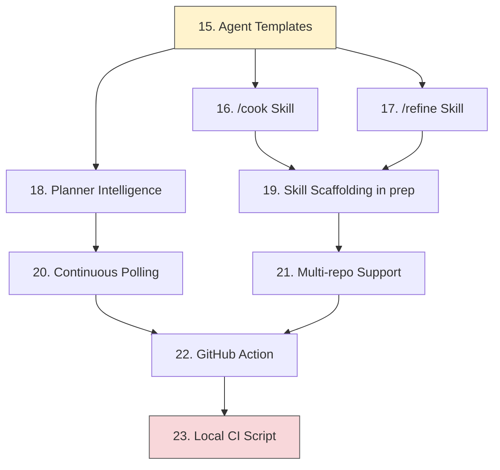

# Roadmap

Post-launch implementation plan for oven-cli. Phases 1-14 (core CLI) are complete. Each phase below is a self-contained unit of work that can be implemented end-to-end in one session using atomic conventional commits. Every phase must compile, pass clippy, pass fmt, and have tests green before moving to the next.

**Coverage gate:** Every phase that adds or modifies Rust code must maintain at least 85% line coverage. Run `cargo llvm-cov nextest --fail-under-lines 85` as the final check before considering a phase done. If coverage drops below 85%, add tests before moving on.

Read CLAUDE.md for conventions, dependencies, and project structure. Read DECISIONS.md for design rationale.

## Phase dependency graph



Phases 15-17 can be worked in parallel. Phase 18 and 19 can be worked in parallel. Phase 22 depends on most other phases being stable. Phase 23 has no hard dependencies and can be done at any time.

## Progress

| Phase | Status | Notes |
|-------|--------|-------|
| 1-14. Core CLI | done | All commands, pipeline, CI, 179 tests, 80.57% coverage |
| 15. Agent Templates | todo | Upgrade bare-bones templates with scope discipline, checklists, structured output |
| 16. /cook Skill | todo | Interactive issue design skill |
| 17. /refine Skill | todo | Codebase audit skill |
| 18. Planner Intelligence | todo | Actually invoke planner, smarter batching, complexity classification |
| 19. Skill Scaffolding in prep | todo | Embed skills in binary, scaffold during oven prep |
| 20. Continuous Polling | todo | Pick up new issues mid-run, don't block on batch completion |
| 21. Multi-repo Support | todo | Route issues to target repos via config + issue frontmatter |
| 22. GitHub Action | todo | JS/TS action for running oven in CI |
| 23. Local CI Script | todo | justfile for running full CI locally |

---

## Phase 15: Agent Template Improvements

**Goal:** Upgrade all five agent templates from bare-bones prompts to production-quality agent instructions. The current templates are minimal (the implementer is 27 lines, the merger is 12). Compare with ocak's agents which have scope discipline rules, verification checklists, structured commit workflows, and "when stuck" recovery guidance.

**Files to modify:**
- `templates/implementer.txt`
- `templates/reviewer.txt`
- `templates/fixer.txt`
- `templates/planner.txt`
- `templates/merger.txt`

**Files to create:**
- None (templates already exist, this is a rewrite)

### Details

**Template format:** These are askama templates (`.txt` files in `templates/`). They use `{{ variable }}` syntax for interpolation and `...` for conditionals. Read the existing templates first to understand the syntax and available variables.

**Template variables available:** `{{ ctx.issue_number }}`, `{{ ctx.issue_title }}`, `{{ ctx.issue_body }}`, `{{ ctx.branch }}`, `{{ ctx.pr_number }}` (Option), `{{ ctx.test_command }}` (Option), `{{ ctx.lint_command }}` (Option), `{{ ctx.cycle }}` (for fixer). The `AgentContext` struct is defined in `src/agents/mod.rs`.

**Implementer template -- full reference:**

The implementer is the most critical template. Here is the complete target content for `templates/implementer.txt` (other templates should follow the same level of detail):

````
You are the oven implementer agent. Your job is to implement the following GitHub issue.

<issue_number>{{ ctx.issue_number }}</issue_number>
<issue_title>{{ ctx.issue_title }}</issue_title>
<issue_body>
{{ ctx.issue_body }}
</issue_body>

Branch: {{ ctx.branch }}
PR: #{{ pr }}

## Before You Start

1. Check branch state: `git log main..HEAD --oneline` and `git diff main --stat` -- work may already be partially done
2. Read `CLAUDE.md` for project conventions
3. Read every file listed in the issue's "Relevant files" and "Patterns to Follow" sections
4. When writing new code, find the closest existing example first (neighboring file in the same directory) and mirror its structure exactly

## Scope Discipline (CRITICAL)

You MUST NOT modify code outside the issue's scope. This is the #1 source of pipeline regressions. Specifically:

- Do NOT change existing method signatures unless the issue requires it
- Do NOT change error messages or string literals unless the issue requires it
- Do NOT change query logic (operators, sort order) unless the issue requires it
- Do NOT change data types unless the issue requires it
- Do NOT delete existing tests -- only add new ones or modify tests for code you changed
- Do NOT remove security protections (rate limiting, input validation, access checks)
- Do NOT change configuration files unless the issue requires it

Before each commit, run `git diff main --stat` and verify EVERY changed file is justified by the issue's acceptance criteria. If a file appears that shouldn't be there, revert it with `git checkout main -- <file>`.

## Implementation Rules

- Do NOT add features, refactoring, or improvements beyond what the issue specifies
- Do NOT add comments, docstrings, or type annotations to code you didn't write
- Match the existing code style exactly -- look at neighboring files

## Testing Requirements

Write tests for every acceptance criterion in the issue:

1. Happy path -- the expected behavior works
2. Edge cases -- boundary values, empty inputs, maximum values
3. Error cases -- invalid input, missing data

## Commit Workflow

Make atomic conventional commits as you work. Each commit should represent one logical unit of change. Include tests in the same commit as the code they test.

Format: `<type>(<scope>): <short description>`
Types: `feat`, `fix`, `refactor`, `test`, `docs`, `chore`, `style`

Rules:
- Never use `git add -A` or `git add .` -- stage specific files
- Never commit files with secrets (.env, credentials)
- Do NOT amend previous commits -- always create new ones
- Run lint/tests before committing

## When Stuck

- Test won't pass after 2 attempts: re-read the full source file and test file. The answer is usually in existing code you haven't read yet.
- Can't find the right pattern: look at the nearest neighboring file in the same directory -- don't invent a new approach.
- Unsure what a method does: read the method's test file, not just its source.
- Don't iterate on a broken approach: if your approach fails twice, switch to a different strategy.

## Verification Checklist

After implementation, run these and fix ALL failures before finishing:

1. Scope check: `git diff main --stat` -- verify every file is justified by the issue. Revert unrelated changes.
2. Deleted test check: `git diff main` -- verify you haven't deleted any existing test methods. If you have, restore them.

3. Tests: `{{ cmd }}`


4. Lint: `{{ cmd }}`


Do NOT stop until all commands pass. Maximum 5 fix attempts per command -- if still failing after 5 attempts, report what's failing and why.

## Output

When done, provide a summary:

```
## Changes Made
- [file]: [what changed and why]

## Tests Added
- [test file]: [what's tested]

## Tradeoffs
- [any compromises made and why]

## Verification
- Tests: pass/fail
- Lint: pass/fail
```
````

**Other templates should follow the same pattern** -- detailed, prescriptive, with the same level of specificity. Use the implementer above as the quality bar.

**Reviewer template -- key additions:**

1. **Setup**: read CLAUDE.md, get the diff (`git diff main --stat` then `git diff main`), read every changed file in full (not just the diff).

2. **Structured checklist** replacing the current bullet list:
   - Pattern consistency: follows existing patterns, naming conventions match, file placement matches, no duplication of existing utilities
   - Error handling: appropriate error types, no swallowed errors, no silent failures, error messages don't leak internals
   - Test coverage: every acceptance criterion tested, happy path + edge cases + error cases, tests assert meaningful behavior
   - Code quality: no unnecessary abstractions, no dead code, no hardcoded values, clear naming, no obvious performance issues
   - Acceptance criteria verification: each criterion implemented, tested, matches spec

3. **Severity mapping** -- keep the current JSON output format but add guidance:
   - `critical` maps to "must fix before merge" (bugs, security, missing acceptance criteria, broken tests)
   - `warning` maps to "should fix" (missing edge case tests, minor pattern violations)
   - `info` maps to "noteworthy" (positive aspects, minor suggestions)

4. **Specificity requirement**: "Fix: add validation" is bad. "Fix: add length validation on `name` param at line 15, max 255 chars" is good.

Keep the existing JSON output format -- it's parsed by the review output parser.

**Fixer template -- key additions:**

1. Read the full file for each finding, not just the line number (context matters).
2. Scope discipline: do NOT introduce new issues while fixing. Keep changes minimal.
3. Run `git diff main --stat` after fixes to verify no scope creep.
4. If a finding is unclear or contradictory, skip it and note why in the output.

**Planner template -- key additions:**

1. **Complexity classification** (determines which pipeline steps run):
   - `simple`: single-file changes, config tweaks, dependency bumps, small bug fixes, docs-only, renaming
   - `full`: multi-file features, architectural changes, database migrations, security-sensitive changes, anything touching shared utilities

2. **Conflict detection rules**:
   - CANNOT parallelize: both require database migrations, explicit dependency between issues
   - CAN parallelize even with file overlap (merge step handles rebase conflicts)
   - IDEAL: completely different areas, different modules, one is docs-only

3. **Richer output format** with per-issue metadata:
   ```json
   {
     "batches": [{
       "batch": 1,
       "issues": [{
         "number": 42,
         "title": "Issue title",
         "area": "module/namespace",
         "predicted_files": ["path/to/file"],
         "has_migration": false,
         "complexity": "simple"
       }],
       "reasoning": "Why these can run in parallel"
     }],
     "total_issues": 1,
     "parallel_capacity": 1
   }
   ```

4. Max 5 issues per batch. When in doubt about complexity, use `full`.

**Merger template -- key additions:**

The current merger template is just "run `gh pr ready` and optionally `gh pr merge`". Upgrade to:

1. Verify readiness: do NOT re-run the full test suite (implementer already did). Only re-run if merge conflicts were resolved.
2. Create PR with proper summary: get issue context, get full diff, write PR body with summary, changes list, and test status. PR title uses conventional commit format.
3. Merge with `--squash --delete-branch`.
4. Close the issue with a comment linking to the PR.
5. Clean up: checkout main, pull.
6. Output: structured merge summary (PR number, URL, issue closed, branch deleted, merge commit SHA).

Note: the current pipeline creates the draft PR in `executor.rs` before invoking the merger. The merger's job is to mark it ready, add a proper description, and merge. Adjust the template to work with the existing PR rather than creating a new one.

### Tests
- Each template renders without errors with a sample `AgentContext`
- Implementer template includes scope discipline section
- Reviewer template includes all checklist categories
- Planner template structured JSON output example is valid JSON
- Merger template references the PR number from context
- Templates include conditional sections (test_command, lint_command) correctly

### Commits
1. `feat(agents): upgrade implementer template with scope discipline and verification`
2. `feat(agents): upgrade reviewer template with structured checklist`
3. `feat(agents): upgrade fixer template with scope constraints`
4. `feat(agents): upgrade planner template with complexity classification`
5. `feat(agents): upgrade merger template with PR workflow`

### Done when
- All five templates are significantly more detailed than current versions
- Templates render correctly with askama
- Scope discipline rules are in implementer and fixer templates
- Reviewer keeps JSON output format compatible with existing parser
- Planner output format includes complexity field
- All tests pass, clippy and fmt clean
- Coverage >= 85%

---

## Phase 16: /cook Skill

**Goal:** Create the `/cook` Claude Code skill for interactive issue design. When a user runs `/cook add retry logic to the pipeline`, it researches the codebase, asks clarifying questions, and produces an implementation-ready GitHub issue that an agent with zero prior context can pick up.

Inspired by ocak's `/design` skill but adapted for oven's Rust/kitchen theme and conventions.

**Files to create:**
- `templates/skills/cook.md`

### Details

**Skill structure:**

```markdown
---
name: cook
description: Interactive issue design -- researches the codebase and produces implementation-ready GitHub issues
disable-model-invocation: false
---
```

The skill file is a Claude Code skill markdown file that gets scaffolded into `.claude/skills/cook/SKILL.md` during `oven prep`.

**Phase 1 -- Research (silent):**

Before asking any questions, research the codebase:
1. Read CLAUDE.md for conventions, patterns, and architecture
2. Use Glob and Grep to find files related to the user's description
3. Read the most relevant files to understand current behavior, patterns, and data models
4. Identify which areas of the codebase this touches
5. Find existing tests, modules, and traits that are relevant
6. Check for similar patterns already implemented that the issue should follow

**Phase 2 -- Clarify:**

Ask the user 2-5 targeted questions. Focus on:
- **Intent**: What problem does this solve? Who benefits?
- **Scope**: What's the minimum viable version? What should be explicitly excluded?
- **Behavior**: What should happen in edge cases? What error states exist?
- **Priority**: Is this blocking other work?

Do NOT ask questions answerable from the codebase. Do NOT ask generic questions -- be specific based on Phase 1 findings.

**Phase 3 -- Draft issue:**

Write the issue in this format:

```markdown
## Context

[1-3 sentences: what part of the system this touches, why it matters, specific modules/files involved]

**Relevant files:**
- `path/to/file` -- [what it does]
- [list ALL files the implementer will need to read or modify]

## Current Behavior

[What happens now, or "This feature does not exist yet." Be specific -- include actual code behavior]

## Desired Behavior

[Exactly what should change. Use concrete examples:]

**Example 1:** When [specific input/action], the system should [specific output/behavior].

## Acceptance Criteria

- [ ] When [specific condition], then [specific observable result]
- [ ] When [edge case], then [specific handling]
- [ ] When [error condition], then [specific error response/behavior]
- [ ] [Each criterion must be independently testable]

## Implementation Guide

[Specific files to create/modify, with the approach:]
- Create `path/to/new_file` -- [what it does, key methods/structs]
- Modify `path/to/existing_file` -- [what to add/change]

### Patterns to Follow
- Follow the pattern in `path/to/example` for [specific pattern]
- Match the structure in `path/to/reference` for [specific convention]

## Security Considerations

[One of:]
- N/A -- no security surface
- Auth: [who can access this, what scoping is needed]
- Validation: [what input must be validated]
- Data exposure: [what sensitive data could leak]

## Test Requirements

- `path/to/test_file`: [specific test cases]
- Edge cases: [list specific edge cases to test]
- Error cases: [list specific error scenarios]

## Out of Scope

- [Thing that might seem related but is NOT part of this issue]
- [Another boundary -- be explicit to prevent scope creep]

## Dependencies

- [Issue #N must be completed first because...], or
- None
```

**Phase 4 -- Review and create:**

1. Show the draft to the user
2. Ask if anything needs adjustment
3. After approval, offer to create the issue:
   ```bash
   gh issue create --title "Brief imperative title (under 70 chars)" --body "..." --label "o-ready"
   ```
4. If the user described multiple things, break them into separate issues

**Writing style rules:**
- Direct and specific -- like a senior engineer writing for a contractor
- No vague language: never say "improve", "clean up", "refactor" without specifying exactly what changes
- Every file path must be real and verified against the codebase
- Every pattern reference must point to an actual existing file
- Acceptance criteria must be testable by running a specific command or assertion

### Tests
- Skill template is valid markdown with correct frontmatter
- Template includes all four phases
- Template includes the full issue format
- Skill file embeds correctly via `include_str!`

### Commits
1. `feat(skills): add /cook interactive issue design skill`

### Done when
- `/cook` skill template exists and is complete
- Issue format covers all sections (context, current/desired behavior, acceptance criteria, implementation guide, security, tests, out of scope, dependencies)
- Phase 2 questions are targeted, not generic
- Writing style section enforces specificity
- Template is embeddable via `include_str!`

---

## Phase 17: /refine Skill

**Goal:** Create the `/refine` Claude Code skill for comprehensive codebase auditing. Runs a multi-dimensional sweep (security, error handling, patterns, tests, data, dependencies) and produces a prioritized findings report. Optionally generates GitHub issues for high-severity findings using the `/cook` format.

Inspired by ocak's `/audit` skill, adapted for Rust codebases and oven conventions.

**Files to create:**
- `templates/skills/refine.md`

### Details

**Skill structure:**

```markdown
---
name: refine
description: Comprehensive codebase audit -- security, error handling, patterns, tests, data, dependencies
disable-model-invocation: true
---
```

**Input:** Optional scope argument (`security`, `errors`, `patterns`, `tests`, `data`, `dependencies`, or empty for all).

**Phase 1 -- Orientation:**
1. Read CLAUDE.md for architecture and conventions
2. Map the project structure using Glob to understand directories and file organization

**Phase 2 -- Static analysis:**
Run all available tools and capture output. Do NOT stop if a tool fails.
```bash
cargo clippy --all-targets 2>&1 || true
cargo +nightly fmt --check 2>&1 || true
cargo deny check 2>&1 || true
```

For non-Rust projects, detect and run appropriate tools (rubocop, eslint, etc.) based on what's in the project.

**Phase 3 -- Manual analysis:**

For each dimension, perform targeted searches and reads. Only run dimensions matching the scope argument (or all if no argument).

**Security** (`security`):
- Auth gaps -- endpoints or handlers missing authentication
- Unvalidated inputs -- user data used without validation
- SQL/command injection -- string interpolation in queries or shell commands (`format!` in SQL, unescaped args in `Command::new`)
- Hardcoded secrets -- passwords, API keys, tokens in source code
- `unsafe` blocks (should be forbidden by lint, but verify)
- Path traversal in file operations
- TOCTOU race conditions

**Error handling** (`errors`):
- `unwrap()` or `expect()` in non-test code
- Swallowed errors (caught with no re-raise, logging, or handling)
- Inconsistent error types (mixing anyhow and thiserror incorrectly)
- Missing error handling in external calls (HTTP, database, file I/O)
- Error messages that leak internals

**Bad patterns** (`patterns`):
- God modules (files > 300 lines)
- TODO/FIXME/HACK/XXX comments
- Dead code or commented-out code
- Code duplication
- Tight coupling between unrelated modules
- Premature abstractions or over-engineering

**Test gaps** (`tests`):
- Public functions/methods without corresponding tests
- Tests that don't assert anything meaningful
- `#[ignore]` tests
- Missing edge case and error path tests
- Test coverage for critical paths (error handling, state transitions)

**Data issues** (`data`):
- Unbounded queries (no LIMIT)
- Missing database indexes
- SQL queries without parameterized statements
- Float for monetary values
- Missing foreign key constraints

**Dependencies** (`dependencies`):
- `cargo deny check` results
- Unused dependencies (`cargo machete` if available)
- Overly broad version constraints

**Phase 4 -- Report:**

Output findings grouped by severity. Every finding must have a specific file path and line number.

```
# Codebase Audit Report

**Scope**: [all | security | errors | patterns | tests | data | dependencies]

## Critical (fix immediately)

### [Finding title]
**File**: `path/to/file:42`
**Category**: [Security | Error Handling | Pattern | Test Gap | Data | Dependency]
**Issue**: [Specific description of what's wrong]
**Impact**: [What could go wrong]
**Fix**: [Exact steps to remediate]

## High (fix soon)
...

## Medium (should fix)
...

## Low (consider fixing)
...

## Summary

| Category | Critical | High | Medium | Low |
|----------|----------|------|--------|-----|
| Security | N | N | N | N |
| Error Handling | N | N | N | N |
| Patterns | N | N | N | N |
| Test Gaps | N | N | N | N |
| Data | N | N | N | N |
| Dependencies | N | N | N | N |
| **Total** | **N** | **N** | **N** | **N** |
```

**Phase 5 -- Issue generation:**

After presenting the report, offer:

> I found N critical and N high findings. Want me to generate GitHub issues for them?

If the user accepts, generate issues using the `/cook` format and offer to create them with `gh issue create --label "o-ready"`.

### Tests
- Skill template is valid markdown with correct frontmatter
- Template includes all six analysis dimensions
- Template includes the report format with severity levels
- Skill file embeds correctly via `include_str!`

### Commits
1. `feat(skills): add /refine codebase audit skill`

### Done when
- `/refine` skill template exists and is complete
- All six analysis dimensions are covered with Rust-specific checks
- Report format includes severity table
- Phase 5 connects back to /cook for issue generation
- Template is embeddable via `include_str!`

---

## Phase 18: Planner Intelligence

**Goal:** Actually invoke the planner agent during pipeline execution and use its output to determine batching, parallelization, and complexity classification. Currently the planner template exists but is never called -- issues go straight to `run_batch()` with no analysis.

**Files to modify:**
- `src/pipeline/runner.rs`
- `src/pipeline/executor.rs`
- `src/agents/mod.rs`

**Files to create:**
- `src/agents/planner.rs` (planner output parsing, if not already separate)

### Details

**What changes:**

Currently `polling_loop()` fetches all `o-ready` issues and passes them directly to `run_batch()`. After this phase, the flow becomes:

```
poll -> fetch o-ready issues -> invoke planner agent -> parse batching output -> run batches sequentially
```

**Planner invocation:**

```rust
// In polling_loop or a new plan_and_execute function:
let issues = executor.github.get_issues_by_label(&ready_label).await?;
if issues.is_empty() { continue; }

// Invoke planner to decide batching
let plan = executor.plan_issues(&issues).await?;

// Execute batches sequentially, issues within a batch in parallel
for batch in plan.batches {
    let batch_issues: Vec<Issue> = batch.issues.iter()
        .filter_map(|bi| issues.iter().find(|i| i.number == bi.number).cloned())
        .collect();
    run_batch(&executor, batch_issues, max_parallel, auto_merge).await?;
}
```

**Planner output parsing:**

Parse the planner's JSON output into a structured type:

```rust
#[derive(Debug, Deserialize)]
pub struct PlannerOutput {
    pub batches: Vec<Batch>,
    pub total_issues: u32,
    pub parallel_capacity: u32,
}

#[derive(Debug, Deserialize)]
pub struct Batch {
    pub batch: u32,
    pub issues: Vec<PlannedIssue>,
    pub reasoning: String,
}

#[derive(Debug, Deserialize)]
pub struct PlannedIssue {
    pub number: u32,
    pub title: String,
    pub area: String,
    pub predicted_files: Vec<String>,
    pub has_migration: bool,
    pub complexity: Complexity,
}

#[derive(Debug, Deserialize, PartialEq)]
#[serde(rename_all = "lowercase")]
pub enum Complexity {
    Simple,
    Full,
}
```

Use the same JSON-in-text extraction approach as the reviewer output parser in `src/agents/reviewer.rs` (`parse_review_output` function). That function uses a regex to find JSON within the agent's text response (which may be wrapped in markdown code fences). Copy or generalize that approach.

**Complexity-based pipeline steps:**

Pass complexity classification through to the executor. When complexity is `simple`, skip certain steps (this prepares for future phases where the pipeline has more steps like security review, documentation, audit). For now, the only difference is metadata -- record it in the `runs` table for reporting.

Add a `complexity` column to the `runs` table via a new migration.

**Fallback behavior:**

If the planner fails or returns unparseable output, fall back to the current behavior: put all issues in one batch with `full` complexity. Log a warning. Never block the pipeline on a planner failure.

**Planner is optional for explicit IDs:**

When `oven on 42,43` is used (explicit issue IDs), skip the planner. The user already decided what to run. Only invoke the planner when polling discovers issues.

### Tests
- Planner output parsing handles valid JSON
- Planner output parsing handles JSON in code fences
- Planner output parsing handles malformed/missing JSON (falls back to single batch)
- Complexity enum deserializes from "simple" and "full"
- Fallback behavior: planner failure results in all issues in one batch
- Batches execute sequentially, issues within a batch in parallel
- Explicit IDs skip the planner
- New migration adds complexity column

### Commits
1. `feat(agents): add planner output parser with batch and complexity types`
2. `feat(pipeline): invoke planner agent during polling loop`
3. `feat(db): add complexity column to runs table`
4. `test(pipeline): add planner integration and fallback tests`

### Done when
- Planner agent is actually invoked when polling discovers issues
- Planner output is parsed into structured batches
- Batches execute in order, with parallelism within each batch
- Planner failure falls back gracefully
- Explicit IDs skip the planner
- Complexity is recorded in the database
- All tests pass, clippy and fmt clean
- Coverage >= 85%

---

## Phase 19: Skill Scaffolding in prep

**Goal:** Embed `/cook` and `/refine` skill templates in the binary and scaffold them during `oven prep`, alongside the existing agent templates. The Phase 11 spec called for this but it was never implemented.

**Files to modify:**
- `src/cli/prep.rs`

### Details

**What changes in prep.rs:**

Add a `SKILL_TEMPLATES` const alongside the existing `AGENT_PROMPTS`:

```rust
const SKILL_TEMPLATES: &[(&str, &str, &str)] = &[
    ("cook", "SKILL.md", include_str!("../../templates/skills/cook.md")),
    ("refine", "SKILL.md", include_str!("../../templates/skills/refine.md")),
];
```

In the `run` function, after scaffolding agents:

```rust
// .claude/skills/
for (skill_name, filename, content) in SKILL_TEMPLATES {
    let skill_dir = project_dir.join(".claude").join("skills").join(skill_name);
    std::fs::create_dir_all(&skill_dir)
        .with_context(|| format!("creating .claude/skills/{skill_name}/"))?;
    write_if_new_or_forced(
        &skill_dir.join(filename),
        content,
        args.force,
        &format!(".claude/skills/{skill_name}/{filename}"),
    )?;
}
```

**Scaffolded structure:**
```
.claude/
  agents/
    implementer.md
    reviewer.md
    fixer.md
    planner.md
    merger.md
  skills/
    cook/
      SKILL.md
    refine/
      SKILL.md
```

### Tests
- `oven prep` creates `.claude/skills/cook/SKILL.md`
- `oven prep` creates `.claude/skills/refine/SKILL.md`
- `oven prep` without `--force` skips existing skill files
- `oven prep --force` overwrites existing skill files
- Skill templates are non-empty
- Update `agent_prompts_are_embedded` test to also check skills

### Commits
1. `feat(cli): scaffold /cook and /refine skills during oven prep`

### Done when
- `oven prep` creates skill files in `.claude/skills/`
- Existing tests still pass
- New tests verify skill scaffolding
- `--force` behavior works for skills
- Clippy and fmt clean
- Coverage >= 85%

---

## Phase 20: Continuous Polling

**Goal:** Fix the polling loop so new issues are picked up while existing pipelines are running. Currently `polling_loop()` awaits `run_batch()`, blocking until the entire batch completes. This means a new `o-ready` issue labeled while a batch is running won't be picked up until the batch finishes. DECISIONS.md lists "Continuous planner: Picks up new issues during pipeline runs" as an improvement over ocak, but it's not implemented.

**Files to modify:**
- `src/pipeline/runner.rs`

### Details

**Current behavior (broken):**
```
T=0:   Poll finds [#1, #2] -> start batch -> AWAIT (blocks polling)
T=60:  [#1 still running, polling is blocked]
T=120: [#1, #2 complete] -> poll fires -> finds [#3] -> start batch
```

**Desired behavior:**
```
T=0:   Poll finds [#1, #2] -> spawn tasks (non-blocking)
T=60:  Poll fires -> finds [#3] -> spawn task for #3 (respects semaphore)
T=120: [#1 complete, #3 still running, #2 still running]
```

**Key files:**
- `src/pipeline/runner.rs` -- contains both `run_batch()` (lines 12-58) and `polling_loop()` (lines 61-98)
- `run_batch()` signature: `pub async fn run_batch<R: CommandRunner + 'static>(executor: &Arc<PipelineExecutor<R>>, issues: Vec<Issue>, max_parallel: usize, auto_merge: bool) -> Result<()>`
- The `PipelineExecutor` struct is in `src/pipeline/executor.rs` and has a `run_issue(&self, issue: &Issue, auto_merge: bool)` method

**Implementation approach:**

Replace the sequential `run_batch().await` in `polling_loop()` with a long-lived `JoinSet` and shared semaphore that persists across poll cycles:

```rust
pub async fn polling_loop<R: CommandRunner + 'static>(
    executor: Arc<PipelineExecutor<R>>,
    auto_merge: bool,
    cancel_token: CancellationToken,
) -> Result<()> {
    let poll_interval = Duration::from_secs(executor.config.pipeline.poll_interval);
    let max_parallel = executor.config.pipeline.max_parallel as usize;
    let ready_label = executor.config.labels.ready.clone();
    let semaphore = Arc::new(Semaphore::new(max_parallel));
    let mut tasks = JoinSet::new();

    // Track in-flight issue numbers to avoid double-spawning
    let in_flight: Arc<Mutex<HashSet<u32>>> = Arc::new(Mutex::new(HashSet::new()));

    loop {
        tokio::select! {
            () = cancel_token.cancelled() => {
                info!("shutdown signal received, waiting for in-flight pipelines");
                while let Some(result) = tasks.join_next().await {
                    handle_task_result(result);
                }
                break;
            }
            () = tokio::time::sleep(poll_interval) => {
                match executor.github.get_issues_by_label(&ready_label).await {
                    Ok(issues) => {
                        let in_flight_guard = in_flight.lock().await;
                        let new_issues: Vec<_> = issues.into_iter()
                            .filter(|i| !in_flight_guard.contains(&i.number))
                            .collect();
                        drop(in_flight_guard);

                        for issue in new_issues {
                            let permit = semaphore.clone().acquire_owned().await?;
                            let exec = Arc::clone(&executor);
                            let in_flight = Arc::clone(&in_flight);
                            let number = issue.number;

                            in_flight.lock().await.insert(number);

                            tasks.spawn(async move {
                                let result = exec.run_issue(&issue, auto_merge).await;
                                in_flight.lock().await.remove(&number);
                                drop(permit);
                                (number, result)
                            });
                        }
                    }
                    Err(e) => {
                        error!(error = %e, "failed to fetch issues");
                    }
                }
            }
            Some(result) = tasks.join_next(), if !tasks.is_empty() => {
                handle_task_result(result);
            }
        }
    }

    Ok(())
}
```

**Key design decisions:**

1. **In-flight tracking**: Use a `HashSet<u32>` protected by a `Mutex` to track which issue numbers are currently being processed. This prevents the same issue from being spawned twice (the label transition to `o-cooking` handles this at the GitHub level, but there's a race window between fetching and labeling).

2. **Semaphore is shared across all polls**: If `max_parallel=2` and 2 issues are running, the next poll's issues will block on `semaphore.acquire_owned()` until a slot frees up. This naturally throttles without explicit batching.

3. **Graceful shutdown**: When cancelled, wait for in-flight tasks to complete rather than abandoning them.

4. **`run_batch` still exists** for the explicit-IDs path (`oven on 42,43`). The continuous polling is only for the no-IDs polling mode.

5. **Planner integration**: If Phase 18 is done, the planner is invoked on each poll's new issues to determine ordering. But spawning still happens individually with the semaphore controlling concurrency.

**Interaction with planner (if Phase 18 is complete):**

The planner's batch ordering becomes advisory rather than strictly sequential. The semaphore enforces concurrency limits, and the planner's complexity classification is applied per-issue. If the planner says issues should be sequential (due to dependencies), respect that by not spawning the dependent issue until its dependency completes.

### Tests
- New issues are picked up while existing pipelines run (use short poll interval in test)
- In-flight tracking prevents double-spawning the same issue
- Semaphore limits actual parallelism to `max_parallel`
- Graceful shutdown waits for in-flight tasks
- Cancellation stops the loop after in-flight tasks finish
- Completed task results are logged
- `run_batch` still works for explicit IDs

### Commits
1. `feat(pipeline): continuous polling with in-flight tracking`
2. `feat(pipeline): shared semaphore across poll cycles`
3. `test(pipeline): add continuous polling tests`

### Done when
- New issues are picked up within one poll interval of being labeled
- In-flight tracking prevents duplicate processing
- Semaphore limits concurrency globally
- Graceful shutdown drains in-flight tasks
- Explicit-ID mode still works via `run_batch`
- All tests pass, clippy and fmt clean
- Coverage >= 85%

---

## Phase 21: Multi-repo Support

**Goal:** Route issues to target repos via config and issue frontmatter. A "god repo" holds issues and labels, but PRs and worktrees are created in the target repo. Based on ocak's multi-repo approach.

**Files to modify:**
- `src/config/mod.rs`
- `src/pipeline/executor.rs`
- `src/git/mod.rs`
- `src/github/issues.rs`
- `src/github/prs.rs`

### Details

**Config additions (recipe.toml):**

Project-level:
```toml
[multi_repo]
enabled = true
target_field = "target_repo"  # key in issue frontmatter, default
```

User-level (`~/.config/oven/recipe.toml`):
```toml
[repos]
my-service = "~/dev/my-service"
other-thing = "~/dev/other-thing"
```

Repo name to local path mappings live in user config only (never in project config, since paths are machine-specific). Project config just enables the feature and sets the frontmatter field name.

**Issue frontmatter parsing:**

Issues targeting a non-default repo include YAML frontmatter at the top of the issue body:

```markdown
---
target_repo: my-service
---

Actual issue description here...
```

Add frontmatter parsing to issue processing:

```rust
pub struct ParsedIssue {
    pub issue: Issue,
    pub target_repo: Option<String>,
    pub body_without_frontmatter: String,
}

pub fn parse_issue_frontmatter(issue: &Issue) -> ParsedIssue {
    // Look for --- delimited YAML at the start of the body
    // Extract target_repo field
    // Strip frontmatter from body for agent consumption
}
```

**Worktree and PR routing:**

When `target_repo` is specified:
1. Resolve the repo name to a local path via user config
2. Create the worktree in the target repo's `.oven/worktrees/` directory
3. Create the PR in the target repo (not the god repo)
4. Labels and comments stay on the god repo's issue
5. The agent's working directory is the target repo's worktree

When `target_repo` is not specified (default behavior):
- Everything works as it does today (same repo for issues and PRs)

**Merger behavior in multi-repo mode:**

The merger should NOT close the issue directly via `gh pr merge` closing linked issues (they're in a different repo). Instead, post a comment on the god repo's issue linking to the merged PR in the target repo, then close.

Add `--comment "Implemented in <target-repo>#<pr-number>"` to issue close.

**Config validation:**

- If `multi_repo.enabled = true` but no `[repos]` in user config, warn but don't fail (issues without frontmatter work normally)
- If an issue references a `target_repo` that's not in the user config, fail that issue with a clear error
- If the resolved path doesn't exist, fail with a clear error
- Validate at startup, not per-issue

### Tests
- Frontmatter parsing extracts target_repo from issue body
- Frontmatter parsing handles missing frontmatter (returns None)
- Frontmatter parsing strips frontmatter from body
- Config loading merges repos from user config
- Repo name resolution validates path exists
- Missing repo name in config produces clear error
- Multi-repo disabled (default) works exactly as before
- Worktree created in target repo directory

### Commits
1. `feat(config): add multi-repo config with repo path mappings`
2. `feat(github): add issue frontmatter parsing for target_repo`
3. `feat(pipeline): route worktrees and PRs to target repos`
4. `feat(pipeline): multi-repo merger behavior`
5. `test: add multi-repo integration tests`

### Done when
- Issues can target different repos via YAML frontmatter
- Worktrees and PRs are created in the target repo
- Labels and comments stay on the god repo
- Missing/invalid repo names produce clear errors
- Default (single-repo) behavior is unchanged
- All tests pass, clippy and fmt clean
- Coverage >= 85%

---

## Phase 22: GitHub Action

**Goal:** JS/TS GitHub Action for running oven in CI. Triggered by issue labeling, creates per-issue concurrency groups, uses GitHub App auth. See DECISIONS.md for the full architecture.

**Files to create:**
- `action/action.yml`
- `action/src/index.ts`
- `action/src/install.ts`
- `action/src/run.ts`
- `action/package.json`
- `action/tsconfig.json`
- `action/.eslintrc.json`

### Details

**Architecture: JavaScript action (not Docker, not composite)**
- Fastest cold start, cross-platform
- Installs `claude` CLI + `oven` binary at runtime (not bundled)
- Posts progress updates to PR comments during long runs

**action.yml:**

```yaml
name: 'Oven Pipeline'
description: 'Run oven agent pipeline on labeled GitHub issues'
inputs:
  anthropic-api-key:
    description: 'Anthropic API key'
    required: true
  github-token:
    description: 'GitHub token (from github-app-token action or GITHUB_TOKEN)'
    required: true
  oven-version:
    description: 'Version of oven to install (default: latest)'
    default: 'latest'
  auto-merge:
    description: 'Auto-merge PRs after pipeline completes'
    default: 'false'
  max-parallel:
    description: 'Maximum parallel pipelines'
    default: '2'
  cost-budget:
    description: 'Maximum cost in USD per issue'
    default: '10.0'
runs:
  using: 'node20'
  main: 'dist/index.js'
```

**Triggers (in the consuming repo's workflow):**

```yaml
on:
  issues:
    types: [labeled]
  workflow_dispatch:
    inputs:
      issue-number:
        description: 'Issue number to process'
        required: true

concurrency:
  group: oven-${{ github.event.issue.number || github.event.inputs.issue-number }}
  cancel-in-progress: false
```

**Authentication:**

GitHub App via `actions/create-github-app-token`:
- Short-lived tokens (1hr), fine-grained permissions, bot identity
- `ANTHROPIC_API_KEY` as repository secret
- Optional OIDC for Bedrock/Vertex (future)

**Security:**
- Pin all action dependencies to commit SHAs (not tags)
- `step-security/harden-runner` for network egress monitoring
- Minimal permissions: `issues: write`, `pull-requests: write`, `contents: write`
- Secrets via env vars only (never CLI args)
- Never log secrets

**install.ts:**

1. Determine platform and architecture
2. Download oven binary from GitHub releases (or cargo install as fallback)
3. Download/verify claude CLI
4. Add both to PATH
5. Verify installation: `oven --version`, `claude --version`

**run.ts:**

1. Parse inputs from action context
2. Filter: only proceed if the label matches `o-ready`
3. Set up environment: `ANTHROPIC_API_KEY`, `GH_TOKEN`
4. Run `oven prep` if recipe.toml doesn't exist
5. Run `oven on <issue-number> -m` (if auto-merge) or `oven on <issue-number>`
6. Capture exit code, stdout, stderr
7. Post a summary comment on the issue with results
8. Set outputs: `run-id`, `status`, `cost`, `pr-number`

**Graceful shutdown:**

Register a SIGTERM handler:
1. Post partial results to PR as a comment
2. Push in-progress branch so work isn't lost
3. Exit cleanly

**Build:**

Use `@vercel/ncc` to compile TypeScript into a single `dist/index.js` file. This is the standard approach for JS actions (avoids committing node_modules).

### Tests
- Install script handles linux-x64 and darwin-arm64
- Action skips non-o-ready label events
- Environment variables are set correctly
- Outputs are populated from oven's exit
- Build produces dist/index.js

### Commits
1. `feat(action): add action.yml with inputs, outputs, and metadata`
2. `feat(action): add install script for oven and claude CLI`
3. `feat(action): add run script with issue processing and progress updates`
4. `feat(action): add build config and compile to dist/`
5. `test(action): add action unit tests`
6. `docs(action): add usage example in action README`

### Done when
- Action installs oven and claude CLI
- Action triggers on issue labeling and workflow_dispatch
- Per-issue concurrency groups prevent duplicate runs
- GitHub App auth works (tested with a real app)
- Graceful shutdown posts partial results
- Build produces a single dist/index.js
- All tests pass, lint clean

---

## Phase 23: Local CI Script

**Goal:** Add a `just` task runner config so developers can run the full CI pipeline locally with a single command. Rust projects typically use [just](https://github.com/casey/just) for this (cargo has no built-in task runner, and Makefiles are awkward with Rust toolchains).

**Files to create:**
- `justfile`

**Dependencies:** Install `just` via `cargo install just` or `brew install just`.

### Details

**justfile:**

```just
# Run the full CI pipeline locally (mirrors .github/workflows/ci.yml)
ci: fmt clippy test coverage deny
    @echo "all checks passed"

# Format check (nightly required for import grouping)
fmt:
    cargo +nightly fmt --all --check

# Format and fix
fmt-fix:
    cargo +nightly fmt --all

# Lint
clippy:
    cargo clippy --all-targets -- -D warnings

# Run tests
test:
    cargo nextest run --all-features

# Run tests with coverage (85% threshold)
coverage:
    cargo llvm-cov nextest --lcov --output-path lcov.info --fail-under-lines 85

# Dependency audit (licenses, advisories, sources)
deny:
    cargo deny check

# Quick check: fmt + clippy + test (skip coverage and deny for speed)
check: fmt clippy test
    @echo "quick checks passed"
```

**Why just:**
- Single-file config, no build system overhead
- Cross-platform (unlike Make on Windows)
- Standard in the Rust ecosystem (used by ripgrep, nushell, zed, etc.)
- Recipes are just shell commands, nothing to learn
- `just ci` mirrors exactly what GitHub Actions runs

**Add to CLAUDE.md:** Document `just ci` as the local CI command in the CI pipeline section.

### Tests
- `just ci` runs all five checks in order
- `just check` runs the quick subset
- `just fmt-fix` applies formatting
- Each recipe can run independently

### Commits
1. `chore: add justfile for local CI pipeline`

### Done when
- `just ci` runs fmt, clippy, test, coverage, and deny in order
- `just check` runs the quick subset (fmt, clippy, test)
- Recipes match exactly what `.github/workflows/ci.yml` runs
- CLAUDE.md updated with `just ci` reference
